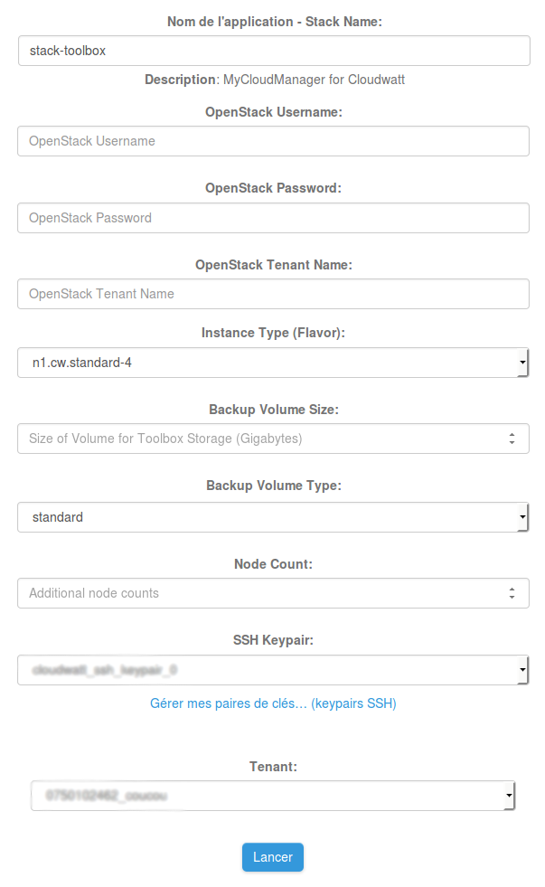
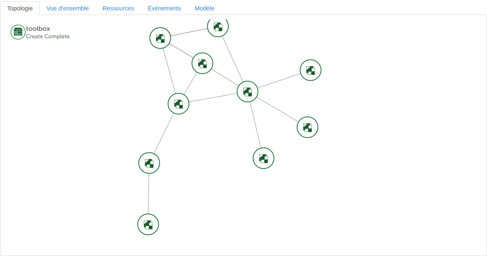
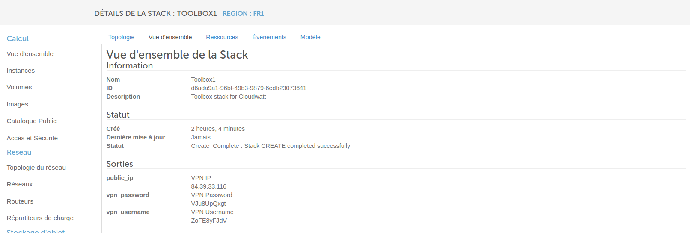
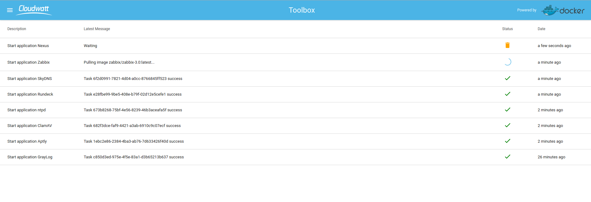
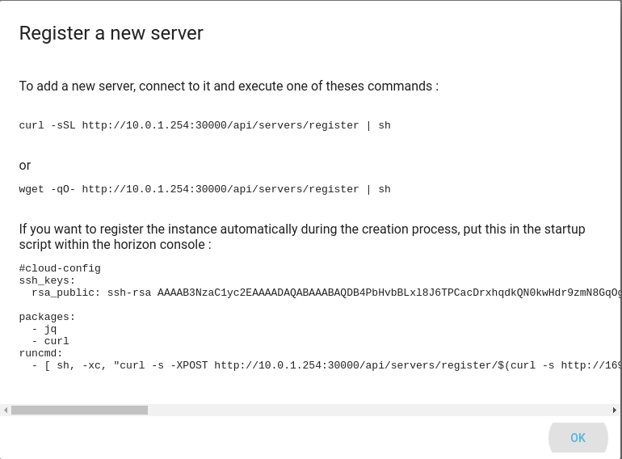

# Innovation Beta: MyCloudManager #

## Work in Progress

This first version of MyCloudManager (Beta) is a different stack of everything the team was able to share with you so far. It aims to bring you a set of tools to **unify, harmonize and monitor your tenant**. In fact it contains a lot of different applications that aims to help you manage day by day your instances :
* Monitoring and Supervision
* Log management
* Jobs Scheduler
* Mirror ClamAV - Antivirus
* Repository app manager
* Time synchronization

MyCloudManager has been completely developed by the CAT team ( Cloudwatt Automation Team).
* it is based on a CoreOS instance
* all applications are deployed via Docker containers on a Kubernetes infrastructure
* The user interface is built in technology React
* Also you can install or configure, from the GUI, all the applications on your instances via Ansible playbooks.
* To secure maximum your Cloudmanager, no port is exposed on the internet apart from port 22 to the management of the stack of bodies and port 1723 for PPTP VPN access.

## Preparations

### The prerequisites

 * Internet access
 * A Linux shell
 * A [Cloudwatt account](https://www.cloudwatt.com/cockpit/#/create-contact) with a [valid keypair](https://console.cloudwatt.com/project/access_and_security/?tab=access_security_tabs__keypairs_tab)
 * The tools [OpenStack CLI](http://docs.openstack.org/cli-reference/content/install_clients.html)

### Initialize the environment

Have your Cloudwatt credentials in hand and click [HERE](https://console.cloudwatt.com/project/access_and_security/api_access/openrc/).
If you are not logged in yet, you will go thru the authentication screen then the script download will start. Thanks to it, you will be able to initiate the shell accesses towards the Cloudwatt APIs.

Source the downloaded file in your shell. Your password will be requested.

~~~ bash
$ source COMPUTE-[...]-openrc.sh
Please enter your OpenStack Password:
~~~

Once this done, the Openstack command line tools can interact with your Cloudwatt user account.

## Install MyCloudManager

### The 1-click

MyCloudManager start with the **1-click** of **Cloudwatt** via the web page [Apps page](https://www.cloudwatt.com/fr/applications/index.html) on the Cloudwatt website.
Choose MyCloudManager apps, press **DEPLOYER**.

After entering your login / password to your account, launch the wizard appears:

As you may have noticed the 1-Click wizard asked to reenter your password Openstack (this will be fixed in a future version of MyCloudManager)
You will find [her]((https://console.cloudwatt.com/project/access_and_security/api_access/view_credentials/) your **tenant ID**, it's  same as **Projet ID**. It will be necessary to complete the wizard.

By default, the wizard deploys two instances of type "standard-4" (n2.cw.standard-4). A variety of other instance types exist to suit your various needs, allowing you to pay only for the services you need. Instances are charged by the minute and capped at their monthly price (you can find more details on the [Pricing page](https://www.cloudwatt.com/en/pricing.html) on the Cloudwatt website).

You must indicate the type [(standard ou performant)](https://www.cloudwatt.com/fr/produits/stockage-bloc/) and the size of the block volume that will be attached to your stack via the `volume_size` parameter.

Finally , you can set a number of nodes to distribute the load. By default, MyCloudManager will be deployed on 1 instance *master* and 1 *slave* node. At maximum, MyCloudManager Beta can be deployed on 1 instance *master* and 3 *slave* node.

Press **DEPLOY**.

The **1-click** handles the launch of the necessary calls on Cloudwatt API :

* Start an instance based on CoreOS,
* Create and attach a block volume standard or performed as you want,
* Start the **toolbox** container,
* Start the **SkyDNS** container

The stack is created automatically. You can see its progression by clicking on its name which will take you to the Horizon console. When all modules become "green", the creation is finished.

Wait **5 minutes** that the entire stack is available.

### Finish OpenVPN access

In order to have access to all functionalities, we have set up a VPN connection.

Here are the steps to follow :

* First retrieve the output information of your stack,

#### Windows 7

* Must now create a VPN connection from your computer , go to "Control Panel > All Control Panel > Network and share center". Click " Set up a connection ....."

* Entry now the retrieved information in the output stack. Initially the *FloatingIP*  and then *login* and *password* provided.

After following this procedure you can now start the VPN connection.

-----
#### Windows 10

* Go to Settings> NETWORK AND INTERNET > Virtual Private Network

* Now enter the information retrieved out of the stack : firstly the FloatingIP and then login and password provided.

After following this procedure you can now start the VPN connection.

-----

You can now access in the MyCloudManager administration interface via the URL **http://manager.default.svc.mycloudmanager** and begin to reap the benefit.

It's (already) done !

## Enjoy

Access to the interface and the various applications is via **DNS** names. Indeed a **SkyDNS** container is launched at startup allowing you to benefit all the names in place. You can access on the different web interfaces applications by clicking **Go** or via URL request (ex: http://zabbix.default.svc.mycloudmanager/).

We have attached a block volume to your stack in order to save all **data** MyCloudManager.
The volume is mounted on the master instance and all nodes in your MyCloudManager in the `/dev/vdb`. This allows our stack to be much more robust. The data being synchronized on all nodes, it allows applications to have access to their data regardless of the node where the  are created.

#### Interface Overview

Here is the home of the MyCloudManager, each thumbnail representing an application ready to be launched. In order to be as scalable and flexible as possible, all applications of MyCloudManager are containers Docker.

A menu is present in the top left of the page, it can move through the different sections of MyCloudManager, we'll detail them later.
* Apps: Application List
* Instances: list of visible instances of MyCloudManager
* Tasks : all ongoing or completed tasks
* Audit: list of actions performed
* My Instances> Console: access to the console Horizon
* My account> Cockpit ; access to the dashboard

All of the applications in the **Apps** section are configurable through by **Settings** button  on each thumbnail.

As you can see, we have separated them into different sections.

In the **Info** section you will find a presentation of the application with some useful links on the application.

In the **Environments** section you can register here all the parameters to be used to configure the variables of the container to its launch environment.

In the **Parameters** section you can register here all the different application configuration settings.

To identify the applications running on those that are not, we have set up a color code : An application is started will be surrounded by a **green halo** and a **yellow halo** during installation.

The **tasks** make the tracking of actions performed on MyCloudManager. It is reported in relative time.

It is possible for you to cancel pending on error spot in the **tasks** menu by clicking  which will then show you what logo .

We also implemented a **audit** section so you can see all actions performed on each of your instances and export to Excel (.xlsx ) if you want to make a post-processing or keep this information for safety reasons via the button .

Finally , we integrated two navigation paths in the MyCloudManager menu : **My Instances** and **My Account**. They are respectively used to access the Cloudwatt Horizon console and to manage your account via the Cockpit interface.

### Add instances to MyCloudManager

To add instances to MyCloudManager, 3 steps:

  1. Attach your router instance of MyCloudManager
  1. Run the script attachment
  3. Start the desired services

#### 1. Attach the instance at the instance of router:

~~~bash
$ neutron router-interface-add $MyCloudManager_ROUTER_ID $Instance_subnet_ID
~~~

You will find all the information by inspecting the stack of resources via the command next heat :

~~~bash
$ heat resource-list $stack_name
~~~

Once this is done you are now in the ability to add your instance to MyCloudManager to instrumentalize .

#### 2. Start the attachment script:

On MyCloudManager, go to the **instance** menu and click the button  at the bottom right.

We offer two commands to choose: one **Curl** and one **Wget** and a command to run a script to create the instance.

Once the script is applied to the selected instance it should appear in the menu **instance** of your MyCloudManager .

**Trick** If you want to create an instance via the console horizon Cloudwatt and declare **directly** in your MyCloudManager, you should to select - in step 3 of the instance launch wizard - MyCloudManager network and the Security Group and - in step 4 - you can paste the command under the setence "If you want to register the instance automatically during the creation process, put this in the startup script within the horizon console :" command in the Custom Script field.

#### 3. Start the required services on the instance :

To help you maximum we created playbooks Ansible to automatically install and configure the agents for different applications.

To do this, simply click on the application you want to install on your machine. The playbook Ansible concerned will be automatically installed.
Once the application is installed, the application logo switch to color, allowing you to identify the applications installed on your instances.

## The MyCloudManager services provided by applications

In this section, we will present different service MyCloudManager.

### Monitoring and supervision
We have chosen to use *Zabbix*, the most popular application for monitoring, supervision and alerting .
Zabbix application is free software **to monitor the status of various network services , servers and other network devices** but also **applications and software** worn on the supervised servers; and producing dynamic graphics resource consumption.
Zabbix uses MySQL, PostgreSQL or Oracle to store data. According to the large number of machines and data to monitor the choice of SGBD greatly affects performance. Its web interface is written in PHP and provided a real-time view on the collected metrics.

To go further, here are some helpful links :
* http://www.zabbix.com/
* https://www.zabbix.com/documentation/3.0/start

### Log Management

We chose Graylog which is the product of the moment for log management , here is a short presentation :
Graylog is an open source **log management** platform capable of manipulating and presenting data from virtually any source. This container is the offer officially by Graylog teams.
  * The Graylog Web Interface is a powerful tool that allows anyone to manipulate the entirety of what Graylog has to offer through an intuitive and appealing web application.
  * At the heart of Graylog is it's own strong software. Graylog Server interacts with all other components using REST APIs so that each component of the system can be scaled without comprimising the integrity of the system as a whole.
  * Real-time search results when you want them and how you want them: Graylog is only able to provide this thanks to the tried and tested power of Elasticsearch. The Elasticsearch nodes behind the scenes give Graylog the speed that makes it a real pleasure to use.

Enjoying this impressive architecture and a large library of plugins, Graylog stands as a strong and versatile solution for **log management both instances** but also worn **applications and software** on monitored instances.

To go further, here are some helpful links :
* https://www.graylog.org/
* http://docs.graylog.org/en/1.2/pages/getting_started.html#get-messages-in
* http://docs.graylog.org/en/1.3/pages/architecture.html
* https://www.elastic.co/products/elasticsearch
* https://docs.mongodb.org/manual/tutorial/install-mongodb-on-ubuntu/

### Job Scheduler
We have chosen to use *Rundeck*.
The Rundeck application will allow you **to schedule and organize all jobs** that you want to deploy consistently on all of your holding via its web interface.

In next version of MyCloudManager, we will give you the possibility to backup your servers like as we saw in the *bundle* Duplicity.

To go further, here are some helpful links :
* http://rundeck.org/
* http://blog.admin-linux.org/administration/rundeck-ordonnanceur-centralise-opensource-vient-de-sortir-sa-v2-0
* http://dev.cloudwatt.com/fr/blog/5-minutes-stacks-episode-vingt-trois-duplicity.html

### Mirror Antivirus
This application is a Ngnix server. A *CRON* script will run every day to pick up the latest **virus** definition distributed by *ClamAV*. The recovered packet will be exposed to your instances via Ngnix allowing you to have customers **ClamAV** update without your instances not necessarily have access to the internet.

To go further, here are some helpful links :
* https://www.clamav.net/documents/private-local-mirrors
* https://github.com/vrtadmin/clamav-faq/blob/master/mirrors/MirrorHowto.md

### Software repository
We have chosen to use *Artifactory*.
Artifactory is an application that can display any type of directory server via a Ngnix . Here our aim is to offer an application that can **expose a repository** for all of your instances.

To go further, here are some helpful links :
* https://www.jfrog.com/open-source/
* https://www.jfrog.com/confluence/display/RTF/Welcome+to+Artifactory

### Time Synchronisation
We have chosen to use NTP.
NTP container is used here so that all of your instances without access to the internet can be synchronized to the same time and access to **a server time**.

To go further, here are some helpful links :
  * http://www.pool.ntp.org/fr/

### The MyCloudManager versions **v1** (Beta)

  - CoreOS Stable 899.13.0
  - Docker 1.10.3
  - Zabbix 3.0
  - Rundeck 2.6.2
  - Graylog 1.3.4
  - Artifactory 4.7.5
  - Nginx 1.9.12
  - Aptly  0.9.6
  - SkyDNS 2.5.3a
  - Etcd 2.0.3

### List of distributions supported by MyCloudManager

* Ubuntu 14.04
* Debian Jessie
* Debian Wheezy
* CentOS 7.2
* CentOS 7.0
* CentOS 6.7

## Troubleshooting

Although it's architecture is based on Docker containers and orchestrator Kubernetes it may MyCloudManager having trouble to instrumentalize instances. Some tracks :
* Make sure your VPN connection is active
* Otherwise restart your VPN
* Refresh the page MyCloudManager by refreshing your browser ( F5 )
* If your toolbox is active , you are connected to the VPN, but you do not get access to the http://manager.default.svc.mycloudmanager try with http://10.0.1.254:30000. If this URL works is that the DNS has not been changed on your computer, you must then either disable your various Antivirus or firewall that could possibly block this connection. The DNS are located in 10.0.2.2.
* If you are unable to launch applications when you click GO to DNS problems, try the address
http://10.0.1.254:30000, then re-click GO. Your applications will launch with the fixed IP address (eg http://10.0.1.254:30601/ for Zaabix).
* Feel free to do a flushdns via the command ` ipconfig / flushdns` it will effectively flush the DNS cache.
* If your new instance does not appear in MyCloudManager, check you if you have includes the security group of your stack MyCloudManager in your instance. Be carrefull of networks aspects: your instance has to communicate with your MyCloudManager to be instrumentalised.
* We have tested MyCloudManager with Chrome. Some ergonomic differences can appear with other web browsers.

## Application configuration (by default)

As explained before we left the possibility , via the button **Settings** on each thumbnail, enter all application settings to launch the container. However if you did not, don't worry, it's nothing, you can always change the logins and password inside the application.

Login and password by default of MyCloudManager applications :
* Zabbix - Login : **admin** - Password : **zabbix**
* Graylog - Login : **admin** - Password : **admin**
* Rundeck - Login : **admin** - Password: **admin**

Other applications have no web interface, so no login/ password, except **Artifactory** which has no authentication.

## So watt ?

The goal of this tutorial is to accelerate your start. At this point **you** are the master of the stack.

You now have an SSH access point on your virtual machine through the floating-IP and your private keypair (default user name `core`).

You can access the MyCloudManager administration interface via the URL **[MyCloudManager](http://manager.default.svc.mycloudmanager)**

## And after?

This article will acquaint you with this first version of MyCloudManager. It is available to all Cloudwatt users in **Beta mode** and therefore currently free.

The intention of the CAT ( Cloudwatt Automation Team) is to provide improvements on a bimonthly basis. In our roadmap, we expect among others:
* instrumentalisation of Ubuntu 16.04 instance,
* A French version,
* Several operation effectiveness enhancements,
* Add the backup function,
* HA Version,
* An additional menu to contact Cloudwatt supporting teams or command a cloud coaching prestation,
* Support of second region
* many other things

Suggestions for improvement ? Services that you would like ? do not hesitate to contact us [apps@cloudwatt.com](mailto:apps@cloudwatt.com)

-----
Have fun. Hack in peace.

The CAT
