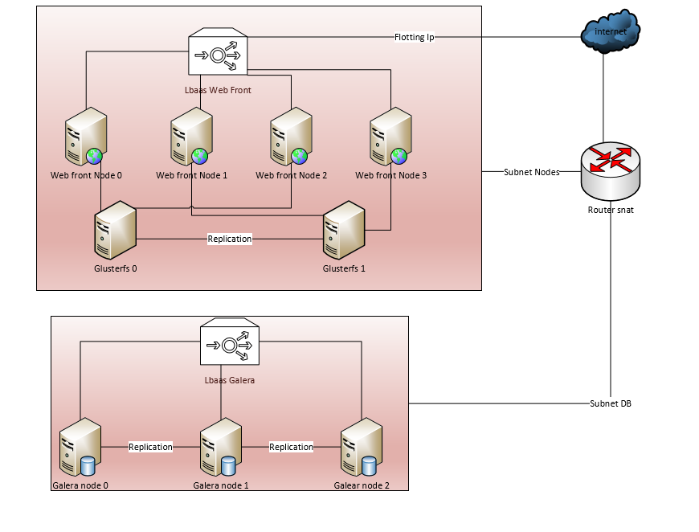
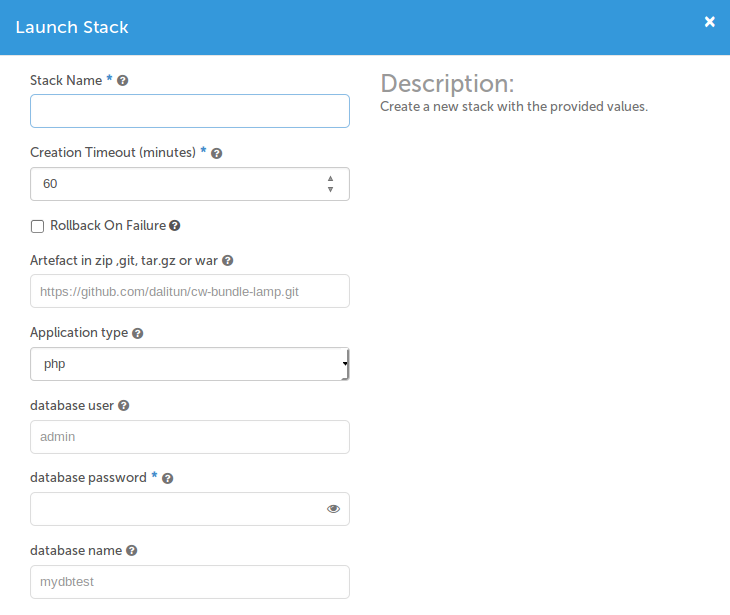
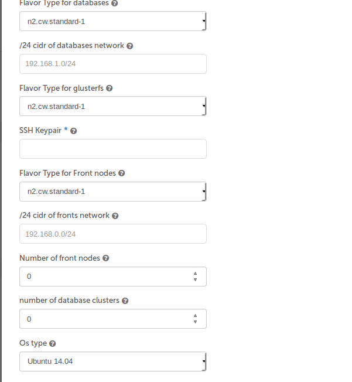
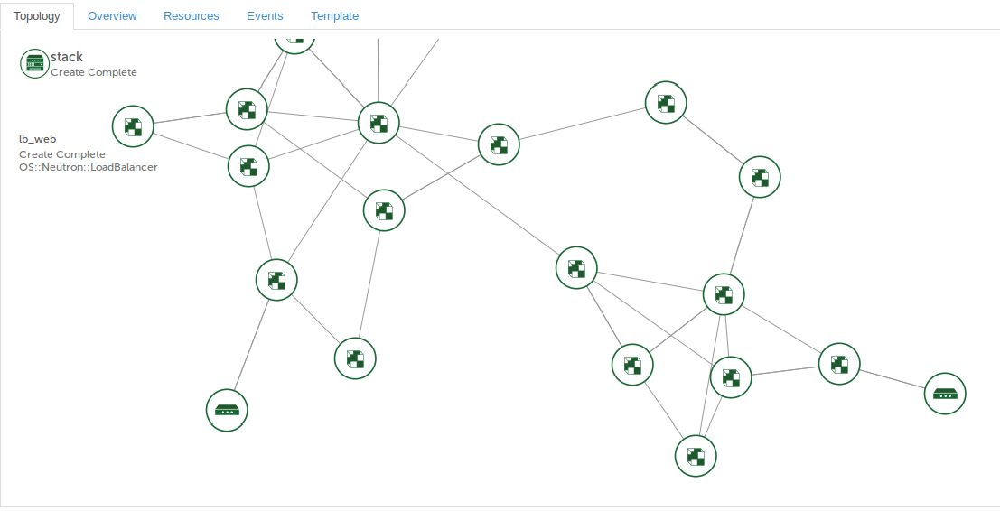
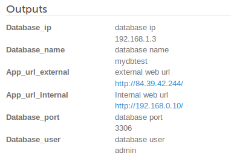

# 5 Minutes Stacks, épisode 26 : Blueprint 3 tiers#

## Episode 26 : Blueprint 3 tiers

### Work in progress

Ce blueprint va vous aider à mettre en place une architecture 3-tiers.
Nous avons automatisé le déploiement des différents noeuds composant l'architecture.
A travers ce blueprint nous vous proposons de mettre en place frontaux web, du glusterfs avec un cluster de base de données.
Vous aurez le choix de déployer sur les frontaux web différentes applications (Apache & php, tomcat 8 ou nodejs).
Voici le schema d'architecture :

## Preparations

### Les versions
 - Ubuntu Trusty 14.04
 - Ubuntu Xenial 16.04
 - Debian Jessie
 - Centos 7.2
 - Glustefs 3.6
 - Mariadb 10.1
 - Lvm2
 - Mylvmbackup
 - Galeracluster 3
 - Nodejs 6.x
 - Apache 2.4
 - Php 5 & 7
 - Openjdk 8
 - Tomcat 8
 - Nginx 1.10

### Les pré-requis

  * Un accès internet
  * Un shell linux
  * Un [compte Cloudwatt](https://www.cloudwatt.com/cockpit/#/create-contact) avec une [ paire de clés existante](https://console.cloudwatt.com/project/access_and_security/?tab=access_security_tabs__keypairs_tab)
  * Les outils [OpenStack CLI](http://docs.openstack.org/cli-reference/content/install_clients.html)

### Initialiser l'environnement

 Munissez-vous de vos identifiants Cloudwatt, et cliquez [ICI](https://console.cloudwatt.com/project/access_and_security/api_access/openrc/).
 Si vous n'êtes pas connecté, vous passerez par l'écran d'authentification, puis le téléchargement d'un script démarrera. C'est grâce à celui-ci que vous pourrez initialiser les accès shell aux API Cloudwatt.

 Sourcez le fichier téléchargé dans votre shell et entrez votre mot de passe lorsque vous êtes invité à utiliser les clients OpenStack.

  ~~~ bash
  $ source COMPUTE-[...]-openrc.sh
  Please enter your OpenStack Password:
  ~~~

 Une fois ceci fait, les outils de ligne de commande d'OpenStack peuvent interagir avec votre compte Cloudwatt.

## Initialiser Blueprint

### 1 clic

Remplissez  les champs suivants puis cliquez sur LAUNCH.

**SSH Keypair :** Votre key pair.

**Artefact in zip ,git, tar.gz or war :** Mettez l'url de l'artifact de votre application, il faut qu'il soit en git, zip ou tar.gz pour les applications php et nodejs et en war pour les applications java.

**Application type :** Si vous choisissez php vous allez avoir un environnement apache2 et php, si vous choisissez nodejs vous allez avoir un environnement qui exécute les applications nodejs avec un reverse proxy nginx et si vous choisissez tomcat vous allez avoir un environnement tomcat 8 et openjdk8 avec nginx comme un reverse proxy.

**Flavor Type for nodes :** Le flavor de noeuds frontaux web.

**Number of front nodes :** Nombre de noeudes fontaux web.

**Flavor Type for glusterfs :** Le flavor des deux noeuds glusterfs.

**/24 cidr of fronts network :** L'adresse réseaux des noeuds frontaux web et glusterfs sous la forme: 192.168.0.0/24.

**Database user :** L'ultisateur de la base de données.

**Database password :** Le mot de passe de l'utlisateur de la base de données.

**Database name :** Le nom de la base de données.

**Flavor Type for databases :** Le flavor des noeuds de la base de données.

**Number of database clusters :** Nombre de noeudes de base la données.

**/24 cidr of databases network :** L'adresse réseaux des noeuds de la base données sous la forme: 192.168.0.0/24.

**OS type :** Vous choisissez l'OS qui vous convient, soit Ubuntu 14.04, Ubuntu 16.04, Debian Jessie ou Centos 7.2

La forme du stack :

Les sorties:

**Database_ip :** L'adresse ip du load balancer de Galeracluster.

**Database_name :** Nom de la base de données.

**Database_user :** Nom de l'utlisateur de la base de données.

**Database_port :** Le port de la base de données.

**App_url_external :** Url externe du load balancer des noeuds frontaux web.

**App_url_internal :** Url interne du load balancer des noeuds frontaux web.

## Enjoy

#### Les dossiers et fichiers de configuration pour les noeuds frontaux web:

* php

`/etc/apache2/sites-available/vhost.conf`: Configuration Apache par défaut sur Debian et Ubuntu.

`/etc/http/conf.d/vhost.conf`: Configuration Apache par défaut sur Centos.

`/var/www/html`: Le répertoire de déploiement de l'application php.

* tomcat

`/usr/share/tomcat`: Le dossier de tomcat.

`/user/share/tomcat/webapps`: Le répertoire de déploiement de l'application java

`/etc/nginx/conf.d/default`: Configuration de reverse proxy.

* nodejs

`/nodejs`: Le répertoire de déploiement de l'application nodejs.

`/etc/nginx/conf.d/default`: Configuration de reverse proxy.

#### Les dossiers et fichiers de configuration pour les deux noeuds Glusterfs:

`/srv/gluster/brick`: Le répertoire qui est repliqué entre les deux noeuds glusterfs.

#### Les dossiers et fichiers de configuration pour les noeuds galera:

`/DbStorage/mysql`: le datadir des neudes Mariadb est un volume cinder.

`/etc/mysql`: Le répertoire de configuration de Mariadb sous Debian and Ubuntu.

`/etc/my.cnf`: Le fichier  de configuration de Mariadb sous Centos.  

`/etc/my.cnf.d`: Le répertoire de configuration de Mariadb sous Centos.

#### Redémarrez les services pour chaque type d'application

* php
Sur Debian et ubuntu
~~~ bash
service apache2 restart
~~~
Sur Centos
~~~ bash
service httpd restart
~~~
* nodejs
~~~ bash
service nginx restart
/etc/init.d/nodejs restart
~~~

* tomcat
~~~ bash
service tomcat restart
service nginx restart
~~~

* Glasterfs
Sur Debian et Ubuntu
~~~ bash
service glusterfs-server restart
~~~
Sur Centos
~~~ bash
service glusterd restart
~~~
* Galera

Sur le premier noeud
~~~ bash
service mysql restart --wsrep-new-cluster
~~~
Sur les autres
~~~ bash
service mysql restart
~~~

#### Exploitation

**Les noeuds Frontaux :**

`/root/deploy.sh` : est un cron pour deployer les applications, vous pouvez l'arrêter si l'application est bien deployée.
si vous voulez redeployer l'application, juste supprimez le contenue du dossier de l'application, lancer ces commandes:
~~~bash
rm -rf /var/www/html/*
##si type de l'application est php.
/root/deploy.sh /var/www/html php url_artifact
##si type de l'application est tomcat
/root/deploy.sh /opt/tomcat/webapps tomcat war_url
##si type de l'application est nodejs
/root/deploy.sh /nodejs nodejs url_artifact
~~~
**Les deux noeuds Glusterfs:**

Le volume gluster est sous la fome ip:/gluster, pour tester qu'il fonctionne bien ,tapez la commande suivante:

~~~bash
gluster volume info
~~~
**Les noeuds de Galeracluster :**

`/root/sync.sh`: est cron pour démarrer les noeuds de Galera, vous pouvez l'arrêter si les noeuds sont bien démarrés,
pour tester, tapez la commande suivante:

~~~bash
mysql -u root -e 'SELECT VARIABLE_VALUE as "cluster size" FROM INFORMATION_SCHEMA.GLOBAL_STATUS  WHERE VARIABLE_NAME="wsrep_cluster_size"'
+--------------+
| cluster size |
+--------------+
| nomber de noeuds mariadb |
+--------------+
~~~

**Backup des noeuds Galeracluster :**
Vous avez deux solutions pour le backup de la base de données.

1) Lancez un cron qui fait des snapshots des volumes cinder qui sont attachés aux noeuds de la base de données :

~~~bash
cinder snapshot-create --display-name snapshot_name.$(date +%Y-%m-%d-%H.%M.%S) id_volume
~~~
2) Lancez un cron qui fait des snapshots de la base de données et le met dans un conteneur swift :

~~~bash
#/bin/bash
mylvmbackup --user=root --mycnf=/etc/mysql/my.cnf --vgname=vg0 --lvname=global --backuptype=tar
swift upload your_back_contenair /var/cache/mylvmbackup/backup/*
rm -rf /var/cache/mylvmbackup/backup/*
~~~

### Autres sources pouvant vous intéresser:
* [ Apache Home page](http://www.apache.org/)
* [ Galera Documentation](http://galeracluster.com/support)
* [ Glusterfs Documentation](https://www.gluster.org/)
* [ Tomcat Documentation](http://tomcat.apache.org/)
* [ Nodejs Documentation](https://nodejs.org/en/)
* [ Nginx Documentation](https://www.nginx.com/resources/wiki/)

----
Have fun. Hack in peace.
