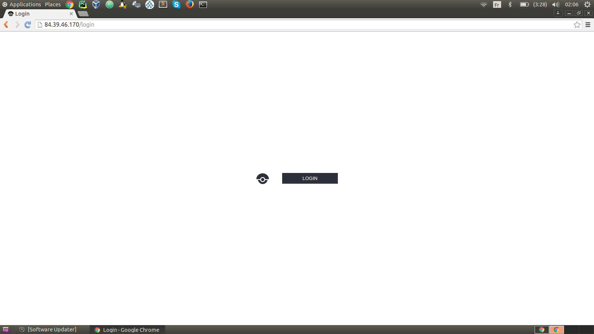
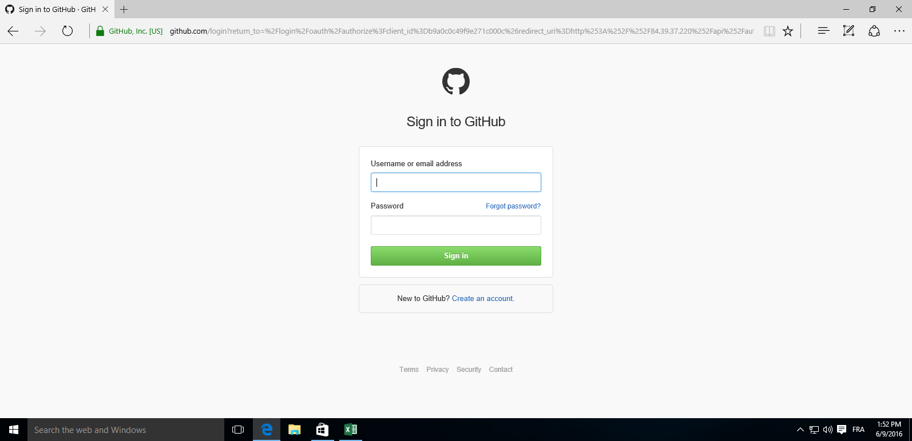
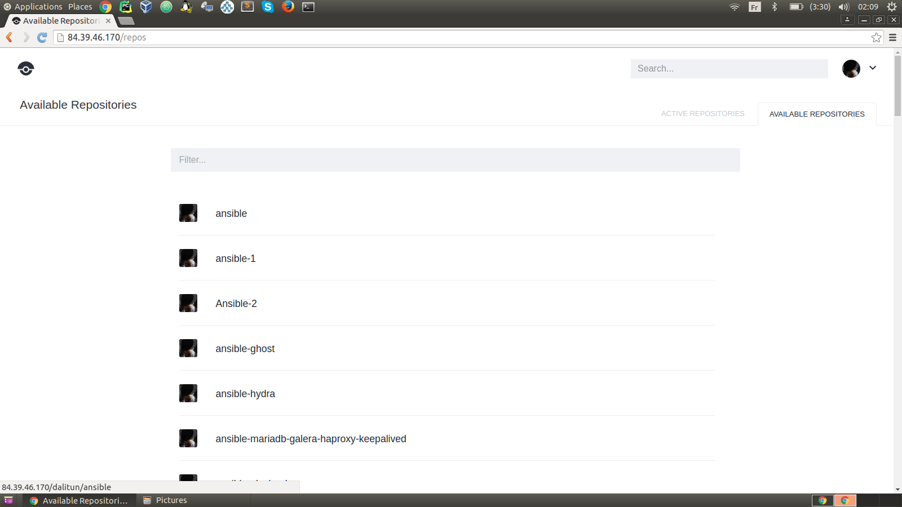
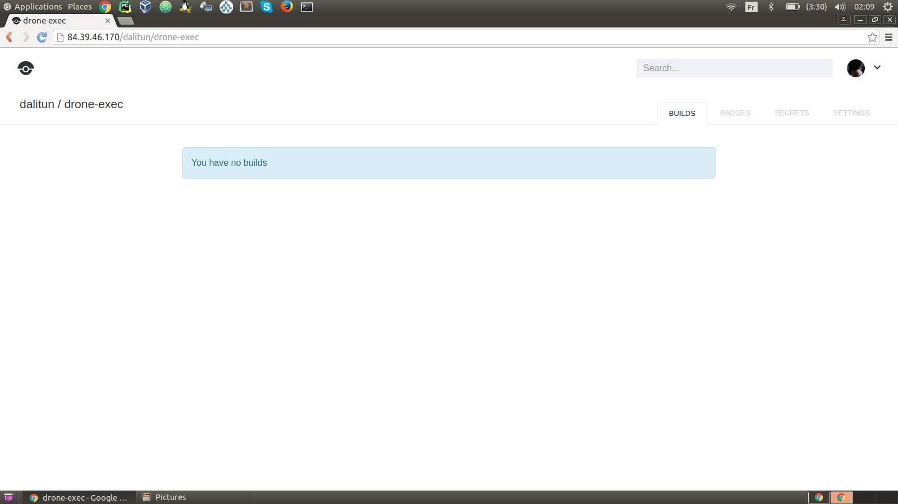
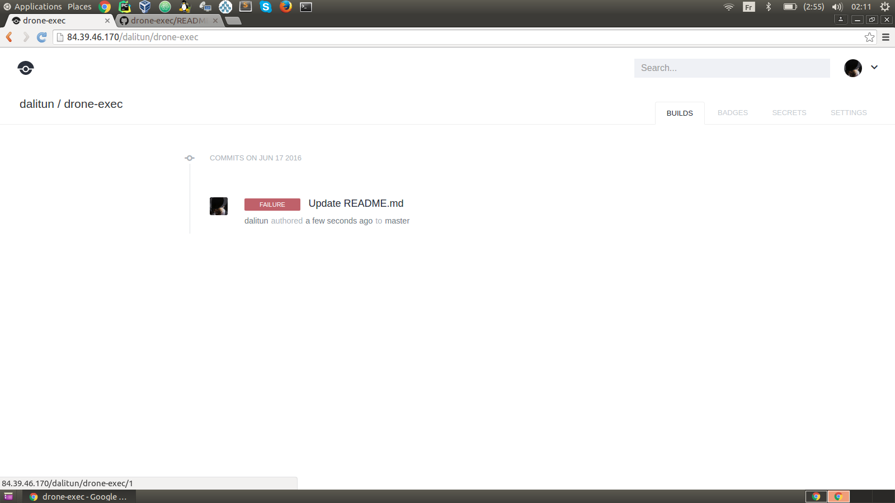

# 5 Minutes Stacks, épisode 28 : Drone #

## Episode 28 : Drone

Drone est un serveur d’intégration continue qui s’appuie sur Docker, permettant aux développeurs de contrôler l’environnement dans lequel s’exécutent les builds de leurs applications. Il s’appuie lui aussi sur un ecosystème de plugins pour s’adapter aux différents environnements, tous ces plugins étant packagés via Docker. 

Drone est un produit initialement disponible en SaaS et rendu open source dans un second temps. Drone.io est le nom de la version SaaS, Drone celui de la version open source.

Cette stack est un blueprint ou modèle de déploiement (et non pas un bundle) car il ne repose pas sur une image spécifique. Ce modèle est construit à partir de l'image CoreOS standard fournit sur le IaaS de Cloudwatt.

## Preparations

### Les versions
  - CoreOS Stable 899.13.0
  - Docker 1.10.3
  - Drone v0.4

### Les pré-requis pour déployer cette stack

Ceci devrait être une routine à présent:
 * Un accès internet
 * Un shell linux
 * Un [compte Cloudwatt](https://www.cloudwatt.com/cockpit/#/create-contact) avec une [ paire de clés existante](https://console.cloudwatt.com/project/access_and_security/?tab=access_security_tabs__keypairs_tab)
 * Les outils [OpenStack CLI](http://docs.openstack.org/cli-reference/content/install_clients.html)
 * Un clone local du dépôt git [Cloudwatt applications](https://github.com/cloudwatt/applications)

### Taille de l'instance
Par défaut, le script propose un déploiement sur une instance de type "standard-1" (n1.cw.standard-1). Il existe une variété d'autres types d'instances pour la satisfaction de vos multiples besoins. Les instances sont facturées à la minute, vous permettant de payer uniquement pour les services que vous avez consommés et plafonnées à leur prix mensuel (vous trouverez plus de détails sur la [Page tarifs](https://www.cloudwatt.com/fr/produits/tarifs.html) du site de Cloudwatt).

Vous pouvez ajuster les parametres de la stack à votre goût.

### Au fait...

Si vous n’aimez pas les lignes de commande, vous pouvez passer directement à la version **"Je lance en 1-clic"** ou **"Je lance avec la console"** en cliquant sur [ce lien](#console)...

## Tour du propriétaire

Une fois le dépôt cloné, vous trouverez le répertoire `blueprint-coreos-drone/`

* `blueprint-coreos-drone.heat.yml`: Template d'orchestration HEAT, qui servira à déployer l'infrastructure nécessaire.

* `stack-start.sh`: Script de lancement de la stack, qui simplifie la saisie des parametres et sécurise la création du mot de passe admin.

## Démarrage

### Initialiser l'environnement

Munissez-vous de vos identifiants Cloudwatt, et cliquez [ICI](https://console.cloudwatt.com/project/access_and_security/api_access/openrc/).
Si vous n'êtes pas connecté, vous passerez par l'écran d'authentification, puis le téléchargement d'un script démarrera. C'est grâce à celui-ci que vous pourrez initialiser les accès shell aux API Cloudwatt.

Sourcez le fichier téléchargé dans votre shell et entrez votre mot de passe lorsque vous êtes invité à utiliser les clients OpenStack.

 ~~~ bash
 $ source COMPUTE-[...]-openrc.sh
 Please enter your OpenStack Password:

 ~~~

Une fois ceci fait, les outils de ligne de commande d'OpenStack peuvent interagir avec votre compte Cloudwatt.

### Ajuster les paramètres

Dans le fichier `blueprint-coreos-drone.heat.yml` vous trouverez en haut une section `parameters`. Le seul paramètre obligatoire à ajuster est celui nommé `keypair_name` dont la valeur `default` doit contenir le nom d'une paire de clés valide dans votre compte utilisateur.
C'est dans ce même fichier que vous pouvez ajuster la taille de l'instance par le paramètre `flavor`.

~~~ yaml
heat_template_version: 2013-05-23

description: Blueprint CoreOS Drone

  parameters:
    keypair_name:       <-- Indiquer ici votre paire de clés par défaut
      description: Keypair to inject in instance
      label: SSH Keypair
      type: string

    flavor_name:      
      default: n1.cw.standard-1     <-- Indiquer ici la taille de l’instance par défaut
      description: Flavor to use for the deployed instance
      type: string
      label: Instance Type (Flavor)
      constraints:
        - allowed_values:
          - n1.cw.standard-1
          - n1.cw.standard-2
          - n1.cw.standard-4
          - n1.cw.standard-8
          - n1.cw.standard-12
          - n1.cw.standard-16

    drone_driver:
      default: github     <-- Indiquer ici le type VCS
      description: Flavor to use for the deployed instance
      type: string
      label: drone driver
      constraints:
        - allowed_values:
            - github
            - gitlab
            - bitbucket
    drone_driver_url:     <-- Indiquer ici l'url VCS
      default: https://github.com
      description:  drone driver url for example https://github.com, https://bitbucket.org/ or your gitlab url
      label:  drone github client
      type: string
    drone_client:         <-- Indiquer ici l'id OAuth client
      description: OAuth id client
      label:  OAuth id client
      type: string
    drone_secret:         <-- Indiquer ici  le code secret OAuth client pour le VCS ultilisé
      description: OAuth secret client
      label: OAuth secret client
      type: string
 [...]
 ~~~
### Démarrer la stack

 Dans un shell, lancer le script `stack-start.sh` :

 ~~~ bash
 $ ./stack-start.sh Drone
 +--------------------------------------+------------+--------------------+----------------------+
 | id                                   | stack_name | stack_status       | creation_time        |
 +--------------------------------------+------------+--------------------+----------------------+
 | xixixx-xixxi-ixixi-xiixxxi-ixxxixixi | Drone     | CREATE_IN_PROGRESS | 2025-10-23T07:27:69Z |
 +--------------------------------------+------------+--------------------+----------------------+
 ~~~

 Attendez **5 minutes** que le déploiement soit complet (vous pouvez utiliser la commande `watch` pour voir le statut en temps réel).

 ~~~ bash
 $ watch -n 1 heat stack-list
 +--------------------------------------+------------+-----------------+----------------------+
 | id                                   | stack_name | stack_status    | creation_time        |
 +--------------------------------------+------------+-----------------+----------------------+
 | xixixx-xixxi-ixixi-xiixxxi-ixxxixixi | Drone     | CREATE_COMPLETE | 2025-10-23T07:27:69Z |
 +--------------------------------------+------------+-----------------+----------------------+
 ~~~

<a name="console" />

## C’est bien tout ça, mais...

### Une Ligne de commande semble aussi amical qu'un management à la militaire

Heureusement pour vous alors, la totalité de la configuration de Drone peut être faite en utilisant uniquement l'interface web.

Pour créer votre stack Drone depuis la [Console Cloudwatt](https://console.cloudwatt.com):

1.	Allez sur le Github Cloudwatt dans le dépôt [applications/blueprint-coreos-drone](https://github.com/cloudwatt/applications/edit/master/blueprint-coreos-drone/)
2.	Cliquez sur le fichier nommé `blueprint-coreos-drone.heat.yml`
3.	Cliquez sur RAW, une page web apparait avec uniquement le template
4.	Enregistrez le fichier sur votre PC. Vous pouvez utiliser le nom proposé par défaut par votre navigateur (juste enlever le `.txt` si besoin)
5.  Allez dans la section [Stacks](https://console.cloudwatt.com/project/stacks/) de la console
6.	Cliquez sur `LAUNCH STACK`, puis `Browse` sous `Template file` et selectionnez le fichier que vous venez d'enregistrer sur votre PC et puis cliquez finalement sur `NEXT`
7.	Nommez votre stack dans le champs `Stack Name`
8.	Entrez le nom de votre keypair dans le champs `SSH Keypair` et remplissez les quelques autres champs 
9.	Choisissez votre instance flavor en utilisant le menu déroulant `Instance Type` et cliquez sur `LAUNCH`

La stack sera automatiquement générée (vous pourrez voir sa progression en cliquant sur son nom). Lorsque tous les modules passeront au vert, la création sera complète. Vous pouvez alors aller dans le menu "instances" pour trouver l'IP-flottante, ou simplement rafraîchir la page courante et vérifier l'onglet Présentation.

Si vous avez atteint ce point, alors votre stack est fonctionnelle ! Profitez de Drone.

### Vous n’auriez pas un moyen de lancer l’application en 1-clic ?

Bon... en fait oui ! Allez sur la page [Applications](https://www.cloudwatt.com/fr/applications/index.html) du site de Cloudwatt, choisissez l'appli, appuyez sur DEPLOYER et laisser vous guider... 2 minutes plus tard un bouton vert apparait... ACCEDER : Coder maintenant !

## Enjoy

 Une fois tout ceci fait, vous pouvez récupérer la description du votre stack à partir de cette commande :

 ~~~ bash
 $ heat stack-show Drone
 +-----------------------+--------------------------------------------------------------------------------------------------------------------------------------+
| Property              | Value                                                                                                                                |
+-----------------------+--------------------------------------------------------------------------------------------------------------------------------------+
| capabilities          | []                                                                                                                                   |
| creation_time         | 2016-06-09T10:53:33Z                                                                                                                 |
| description           | Bleuprint CoreOS Drone                                                                                                                  |
| disable_rollback      | True                                                                                                                                 |
| id                    | a754ce3f-870b-47f9-9863-9ddbe41a0267                                                                                                 |
| links                 | https://orchestration.fr1.cloudwatt.com/v1/7da34701e2fe488683d8a8382ee6f454/stacks/drone/a754ce3f-870b-47f9-9863-9ddbe41a0267 (self) |
| notification_topics   | []                                                                                                                                   |
| outputs               | [                                                                                                                                    |
|                       |   {                                                                                                                                  |
|                       |     "output_value": "http://flottingIp",                                                                                           |
|                       |     "description": "Drone URL",                                                                                                      |
|                       |     "output_key": "floating_ip_url"                                                                                                  |
|                       |   }                                                                                                                                  |
|                       | ]                                                                                                                                    |
| parameters            | {                                                                                                                                    |
|                       |   "OS::project_id": "7da34701e2fe488683d8a8382ee6f454",                                                                              |
|                       |   "OS::stack_id": "a754ce3f-870b-47f9-9863-9ddbe41a0267",                                                                            |
|                       |   "OS::stack_name": "drone",                                                                                                         |
|                       |   "keypair_name": "testkey",                                                                                                         |
|                       |   "drone_driver": "github",                                                                                                          |
|                       |   "drone_client": "********************",                                                                                            |
|                       |   "flavor_name": "n1.cw.standard-1",                                                                                                 |
|                       |   "drone_secret": "****************************************",                                                                        |
|                       |   "drone_url": "https://github.com"                                                                                                  |
|                       | }                                                                                                                                    |
| parent                | None                                                                                                                                 |
| stack_name            | drone                                                                                                                                |
| stack_owner           | youremail@cloudwatt.com                                                                                                 |
| stack_status          | CREATE_COMPLETE                                                                                                                      |
| stack_status_reason   | Stack CREATE completed successfully                                                                                                  |
| stack_user_project_id | eb79ff46f2e44090ada252dc32f62b4a                                                                                                     |
| template_description  | Blueprint CoreOS Drone                                                                                                                  |
| timeout_mins          | 60                                                                                                                                   |
| updated_time          | None                                                                                                                                 |
+-----------------------+--------------------------------------------------------------------------------------------------------------------------------------+

 ~~~

Une fois tout ceci est fait vous pouvez vous connecter sur l'inteface de Drone via un navigateur web à partir de cet url http://flottingIp.

Puis s'authentifier sur le github, bitbucket ou gitlab.

Après vous arrivez à cette page.

Vous choisissez le projet drone et l'activer.

Puis committer une chose dans ce projet et vous allez voir la résultat.

Après le committe.

Pour créer OAuth voir les lien suivants:

* [Pour github](http://readme.drone.io/setup/remotes/github/)
* [Pour gitlab](http://readme.drone.io/setup/remotes/gitlab/)
* [Pour bitbucket](http://readme.drone.io/setup/remotes/bitbucket/)

##### systemd - système d'initialisation de service drone

Pour démarrer le service :
~~~ bash
sudo systemctl start drone.service
~~~

Il est possible de consulter les logs en sortie du service lancé grâce à la commande suivante :
~~~ bash
journalctl -f -u drone.service
~~~

Le service se stop de la manière suivante :
~~~ bash
sudo systemctl stop drone.service
~~~

#### Fichiers configurations
`/home/core/drone.env`: fichier qui contient les variables d'environnements.

## So watt ?

Ce tutoriel a pour but d'accélerer votre démarrage. A ce stade **vous** êtes maître(sse) à bord.

Vous avez un point d'entrée sur votre machine virtuelle en SSH via l'IP flottante exposée et votre clé privée (utilisateur `cloud` par défaut).

### Autres sources pouvant vous intéresser

* [CoreOS homepage](https://coreos.com/)
* [Docker Documentation](https://docs.docker.com/)
* [Drone Documentation](https://drone.io/)

-----
Have fun. Hack in peace.
