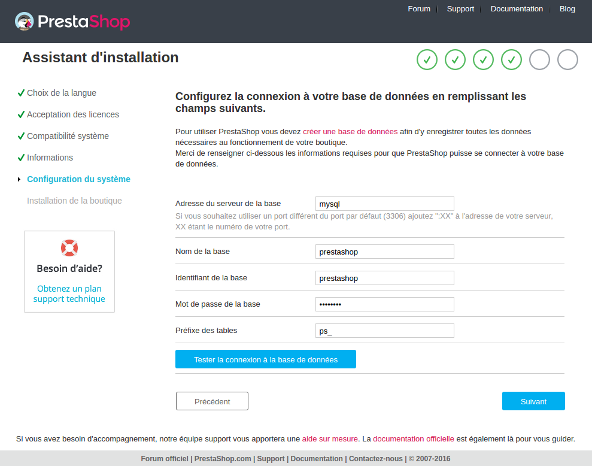

# 5 Minutes Stacks, episode 50 : PrestaShop #

## Episode 50 : PrestaShop

PrestaShop is a CMS, a Content Management System, that allows you to setup an e-commerce's platform. You can manage products catalogue, orders and shippings. 

Thanks to an active community of contributors, many plugins are available to add social networks support or contribute to the search engine optimisation of your website. Others plugins are made to adapt quickly the website to sell in a lot of countries.

Its interface is friendly and responsive to offer to your customers an enjoyable experience on all devices. No development knowledges are required to sell your first products.

PrestaShop is fully developed in PHP and usesa MySQL database to store all its data.

## Preparations

### The Versions
 - CoreOS Stable 1010.6
 - PrestaShop 1.6.1.7

### The prerequisites to deploy this stack

These should be routine by now:
 * An Internet access
 * A Linux shell
 * A [Cloudwatt account](https://www.cloudwatt.com/cockpit/#/create-contact) with a [valid keypair](https://console.cloudwatt.com/project/access_and_security/?tab=access_security_tabs__keypairs_tab)
 * The tools of the trade: [OpenStack CLI](http://docs.openstack.org/cli-reference/content/install_clients.html)
 * A local clone of the [Cloudwatt applications](https://github.com/cloudwatt/applications) git repository (if you are creating your stack from a shell)

### Size of the instance

By default, the stack deploys on an instance of type "Standard 1" (n1.cw.standard-1). A variety of other instance types exist to suit your various needs, allowing you to pay only for the services you need. Instances are charged by the minute and capped at their monthly price (you can find more details on the [Pricing page](https://www.cloudwatt.com/en/pricing.html) on the Cloudwatt website).

 Stack parameters, of course, are yours to tweak at your fancy.

### By the way...

If you do not like command lines, you can go directly to the "run it thru the console" section by clicking [here](#console)

## What will you find in the repository

 Once you have cloned the github, you will find in the `blueprint-coreos-prestashop/` repository:

 * `blueprint-coreos-prestashop.heat.yml`: HEAT orchestration template. It will be use to deploy the necessary infrastructure.
 * `stack-start.sh`: Stack launching script. This is a small script that will save you some copy-paste.
 * `stack-get-url.sh`: Flotting IP recovery script.

## Start-up

### Initialize the environment

Have your Cloudwatt credentials in hand and click [HERE](https://console.cloudwatt.com/project/access_and_security/api_access/openrc/).
If you are not logged in yet, you will go thru the authentication screen then the script download will start. Thanks to it, you will be able to initiate the shell accesses towards the Cloudwatt APIs.

Source the downloaded file in your shell. Your password will be requested.

~~~ bash
$ source COMPUTE-[...]-openrc.sh
Please enter your OpenStack Password:

~~~

Once this done, the Openstack command line tools can interact with your Cloudwatt user account.

### Adjust the parameters

With the `blueprint-coreos-prestashop.heat.yml` file, you will find at the top a section named `parameters`. The sole mandatory parameter to adjust is the one called `keypair_name`. Its `default` value must contain a valid keypair with regards to your Cloudwatt user account. You will also enter the `prestashop` password account of your `MySQL` database. This is within this same file that you can adjust the instance size by playing with the `flavor` parameter.

~~~ yaml
heat_template_version: 2013-05-23

description: Blueprint CoreOS PrestaShop

parameters:
  keypair_name:
    description: Keypair to inject in instance
    label: SSH Keypair
    type: string

  flavor_name:
    default: n1.cw.standard-1
    description: Flavor to use for the deployed instance
    type: string
    label: Instance Type (Flavor)
    constraints:
      - allowed_values:
          - n1.cw.standard-1
          - n1.cw.standard-2
          - n1.cw.standard-4
          - n1.cw.standard-8
          - n1.cw.standard-12
          - n1.cw.standard-16

  sqlpass:
    description: "password sql (user: prestashop)"
    type: string
    hidden: true

[...]
~~~
### Start stack

 In a shell, run the script `stack-start.sh` with his name in parameter:

 ~~~ bash
 ./stack-start.sh PrestaShop
 +--------------------------------------+-----------------+--------------------+----------------------+
 | id                                   | stack_name      | stack_status       | creation_time        |
 +--------------------------------------+-----------------+--------------------+----------------------+
 | ee873a3a-a306-4127-8647-4bc80469cec4 | PrestaShop      | CREATE_IN_PROGRESS | 2015-11-25T11:03:51Z |
 +--------------------------------------+-----------------+--------------------+----------------------+
 ~~~

 Within **5 minutes** the stack will be fully operational. (Use `watch` to see the status in real-time)

 ~~~
 $ watch heat resource-list PrestaShop
 +------------------+-----------------------------------------------------+---------------------------------+-----------------+----------------------+
 | resource_name    | physical_resource_id                                | resource_type                   | resource_status | updated_time         |
 +------------------+-----------------------------------------------------+---------------------------------+-----------------+----------------------+
 | floating_ip      | 44dd841f-8570-4f02-a8cc-f21a125cc8aa                | OS::Neutron::FloatingIP         | CREATE_COMPLETE | 2015-11-25T11:03:51Z |
 | security_group   | efead2a2-c91b-470e-a234-58746da6ac22                | OS::Neutron::SecurityGroup      | CREATE_COMPLETE | 2015-11-25T11:03:52Z |
 | network          | 7e142d1b-f660-498d-961a-b03d0aee5cff                | OS::Neutron::Net                | CREATE_COMPLETE | 2015-11-25T11:03:56Z |
 | subnet           | 442b31bf-0d3e-406b-8d5f-7b1b6181a381                | OS::Neutron::Subnet             | CREATE_COMPLETE | 2015-11-25T11:03:57Z |
 | server           | f5b22d22-1cfe-41bb-9e30-4d089285e5e5                | OS::Nova::Server                | CREATE_COMPLETE | 2015-11-25T11:04:00Z |
 | floating_ip_link | 44dd841f-8570-4f02-a8cc-f21a125cc8aa-`floating IP`  | OS::Nova::FloatingIPAssociation | CREATE_COMPLETE | 2015-11-25T11:04:30Z |
   +------------------+-----------------------------------------------------+-------------------------------+-----------------+----------------------
 ~~~

 The `start-stack.sh` script takes care of running the API necessary requests to execute the normal heat template which:

 * Starts an CoreOS based instance with the docker container *PrestaShop* and the container *MySQL*
 * Expose it on the Internet via a floating IP.

<a name="console" />

## All of this is fine, but...

### You do not have a way to create the stack from the console?

 We do indeed! Using the console, you can deploy PrestaShop:

 1.	Go the Cloudwatt Github in the [applications/blueprint-coreos-prestashop](https://github.com/cloudwatt/applications/tree/master/blueprint-coreos-prestashop) repository
 2.	Click on the file named `blueprint-coreos-prestashop.heat.yml`
 3.	Click on RAW, a web page will appear containing purely the template
 4.	Save the file to your PC. You can use the default name proposed by your browser (just remove the .txt)
 5.  Go to the « [Stacks](https://console.cloudwatt.com/project/stacks/) » section of the console
 6.	Click on « Launch stack », then « Template file » and select the file you just saved to your PC, and finally click on « NEXT »
 7.	Name your stack in the « Stack name » field
 8.	Enter the name of your keypair in the « SSH Keypair » field
 9.  Write a passphrase that will be used for the database prestashop user
 10.	Choose your instance size using the « Instance Type » dropdown and click on « LAUNCH »

 The stack will be automatically generated (you can see its progress by clicking on its name). When all modules become green, the creation will be complete. You can then go to the "Instances" menu to find the floating IP, or simply refresh the current page and check the Overview tab for a handy link.

 If you've reached this point, you're already done! Go enjoy PrestaShop!

### A one-click deployment sounds really nice...

 ... Good! Go to the [Apps page](https://www.cloudwatt.com/en/apps/) on the Cloudwatt website, choose the apps, press **DEPLOY** and follow the simple steps... 2 minutes later, a green button appears... **ACCESS**: you have your e-commerce platform.

## Enjoy

 Once all this makes you can connect on your server in SSH by using your keypair beforehand downloaded on your compute,

 You are now in possession of PrestaShop, you can enter via the URL `http://ip-floatingip`. Your full URL will be present in your stack overview in horizon Cloudwatt console.

 At your first connexion you will ask to give the information about your website and how to access to the database. Complete the fields as below, the password is which one you chose when you created the stack.

Keep in mind to copy the file `config/settings.inc.php` in the aim to restore it if necessary.

You can now setup your e-commerce website, this one being hosted in France in a safe environment, you can completely trust on this product.

## So watt?

The goal of this tutorial is to accelerate your start. At this point **you** are the master of the stack.

You now have an SSH access point on your virtual machine through the floating-IP and your private keypair (default userusername `core`).

* You have access to the web interface via the address specified in your output stack in horizon console.

* Here are some news sites to learn more:

  - https://www.prestashop.com/
  - https://www.prestashop.com/fr/documentatio

----
Have fun. Hack in peace.
