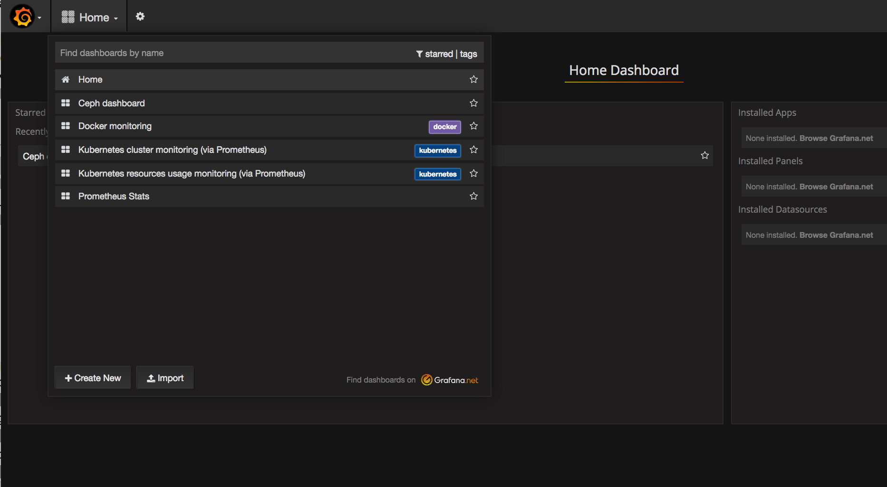
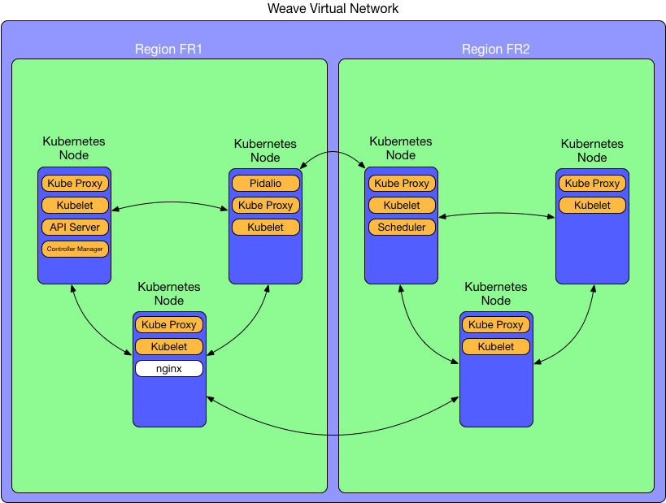

# Blueprint: Kubernetes HA #


Lorsque vous travaillez avec beaucoup de conteneurs, il devient vite indispensable de les orchestrer.

C'est là que Kubernetes entre en jeu.

Kubernetes est un orchestrateur de conteneur Docker et Rkt initié par Google grâce à son savoir-faire en la matière.

Cette stack va vous permettre de déployer un cluster de production en quelques clics.

## Préparations

### Les versions

  - CoreOS Stable 1010.6
  - Docker 1.10.3
  - Kubernetes 1.5.1
  - Ceph 10

### Les pré-requis pour déployer cette stack

Ceci devrait être une routine à présent:

 * Un accès internet

 * Un shell linux ou avoir accès à la console Cloudwatt

 * Un [compte Cloudwatt](https://www.cloudwatt.com/cockpit/#/create-contact) avec une [ paire de clés existante](https://console.cloudwatt.com/project/access_and_security/?tab=access_security_tabs__keypairs_tab)

 * Les outils [OpenStack CLI](http://docs.openstack.org/cli-reference/content/install_clients.html)

 * Un clone local du dépôt git [Cloudwatt applications](https://github.com/cloudwatt/applications)

### Taille de l'instance

Par défaut, le script propose un déploiement sur une instance de type "standard-1" (n1.cw.standard-1). Il existe une variété d'autres types d'instances pour répondre à vos besoins. Les instances sont facturées à la minute, vous permettant de payer uniquement pour les services que vous avez consommés et plafonnées à leur prix mensuel (vous trouverez plus de détails sur la [Page tarifs](https://www.cloudwatt.com/fr/produits/tarifs.html) du site de Cloudwatt).

Vous pouvez ajuster les paramètres de la stack à votre goût.

### Au fait...

Si vous n’aimez pas les lignes de commande, vous pouvez passer directement à la version **"Je lance en 1-clic"** ou **"Je lance avec la console"** en cliquant sur [ce lien](#console)...

## Tour du propriétaire

Une fois le dépôt cloné, vous trouverez le répertoire `blueprint-kubernetes-ha/`

* `stack-fr1.yml`: Template d'orchestration HEAT pour la région FR1, il servira à déployer l'infrastructure nécessaire.
* `stack-fr2.yml`: Template d'orchestration HEAT pour la région FR2, il servira à déployer l'infrastructure nécessaire.
* `stack-start.sh`: Script de lancement de la stack, qui simplifie la saisie des paramètres.

## Démarrage

### Initialiser l'environnement

Munissez-vous de vos identifiants Cloudwatt, et cliquez [ICI](https://console.cloudwatt.com/project/access_and_security/api_access/openrc/).
Si vous n'êtes pas connecté, vous passerez par l'écran d'authentification, puis le téléchargement d'un script démarrera. C'est grâce à celui-ci que vous pourrez initialiser les accès shell aux API Cloudwatt.

Sourcez le fichier téléchargé dans votre shell et entrez votre mot de passe lorsque vous êtes invité à utiliser les clients OpenStack.

 ~~~ bash
 $ source COMPUTE-[...]-openrc.sh
 Please enter your OpenStack Password:

 ~~~

Une fois ceci fait, les outils de ligne de commande d'OpenStack peuvent interagir avec votre compte Cloudwatt.

### Démarrer la stack

 Dans un shell, lancer le script `stack-start.sh` :

 ~~~ bash
 $ ./stack-start.sh
 ~~~

 Le script va vous poser plusieurs questions, puis, une fois la stack crée vous afficher deux lignes :

 ~~~ bash
scale_dn_url: ...
scale_up_url: ...
scale_storage_dn_url: ...
scale_storage_up_url: ...
 ~~~

scale_dn_url est une url que vous pouvez appeler pour diminuer la capacité de votre cluster

scale_up_url est une url que vous pouvez appeler pour augmenter la capacité de votre cluster

scale_storage_up_url est une url que vous pouvez appeler pour augmenter la capacité du cluster Ceph

scale_storage_dn_url est une url que vous pouvez appeler pour diminuer la capacité du cluster Ceph

### Et ensuite

Chaque noeud possède une ip publique et privée.

Le cluster va mettre une dizaine de minutes à s'initialiser, une fois cette durée écoulée, vous pouvez vous connecter en ssh sur l'ip publique de l'un d'entre eux.

Pour lister l'état des composants Kubernetes, vous pouvez executer cette commande :

~~~bash
$ fleetctl list-units
~~~

Elle devrait vous afficher ceci :

~~~
UNIT                       MACHINE                  ACTIVE SUB
pidalio-apiserver.service  62bf699b.../84.39.36.87  active running
pidalio-controller.service b8cc10ee.../84.39.35.207 active running
pidalio-node.service       4f723b52.../84.39.36.13  active running
pidalio-node.service       62bf699b.../84.39.36.87  active running
pidalio-node.service       b8cc10ee.../84.39.35.207 active running
pidalio-proxy.service      4f723b52.../84.39.36.13  active running
pidalio-proxy.service      62bf699b.../84.39.36.87  active running
pidalio-proxy.service      b8cc10ee.../84.39.35.207 active running
pidalio-scheduler.service  4f723b52.../84.39.36.13  active running
pidalio.service            4f723b52.../84.39.36.13  active running
~~~

Pidalio est un utilitaire permettant de bootstrappé facilement un cluster Kubernetes.

Il est composé de six parties :

	- pidalio : Il met a disposition l'ensemble des certificats et ressources nécessaires au fonctionnement du cluster.
	- pidalio-apiserver : correspond au composant API Server de Kubernetes, il fait office de point central des différents composants
	- pidalio-controller : correspond au composant Controller Manager de Kubernetes, il s'occupe de vos Pods
	- pidalio-scheduler : correspond au composant Scheduler, il s'occupe de répartir les Pods dans votre cluster
	- pidalio-proxy : correspond au composant Kube Proxy, il prend soin de votre table iptable pour rediriger automatiquement les services Kubernetes vers les bons pods
	- pidalio-node : correspond au Kubelet, l'agent Kubernetes responsable de chaque Noeud.


Vous pouvez utiliser le client Kubernetes depuis n'importe quel noeud.

Nous allons utiliser le client Kubernetes pour lancer un serveur nginx dans notre cluster :

~~~bash
kubectl run --image=nginx --port=80 nginx
~~~

Ensuite nous allons rendre disponible ce serveur sur internet :

~~~bash
kubectl expose deployment nginx --type=NodePort
kubectl describe service nginx
~~~

Cette dernière commande va vous afficher ceci :

~~~bash
Name:  					nginx
Namespace:     			default
Labels:					run=nginx
Selector:      			run=nginx
Type:  					NodePort
IP:    					10.18.203.177
Port:  					<unset>	80/TCP
NodePort:      			<unset>	24466/TCP
Endpoints:     			10.40.0.2:80
Session Affinity:      	None
No events.
~~~

Vous pouvez noter la présence d'un champ NodePort, ce port correspond au port que vous devez utiliser pour accéder à nginx depuis une des ip publiques de votre cluster.
Assurez-vous d'avoir ouvert ce port dans votre security-group.

Pour accéder à nginx, vous pouvez vous rendre sur n'importe quelle ip publique de votre cluster sur le port 24466

### J’aimerais persister mes données

Il est parfois utile de persister les données des conteneurs mais la tâche est souvent loins loin d'être facile.

C'est pourquoi, vous disposez d'un cluster Ceph prêt à l'emploi.

Tapez cette commande pour lister les volumes :

```bash
rbd ls
```

Tout d'abord, executez cette commande pour créer un volume de 10Go

```bash
rbd create db --size=10G
```

Nous allons maintenant lancer une base de donnée MariaDB avec un volume attaché.

```bash
cat <<EOF | kubectl create -f -
apiVersion: extensions/v1beta1
kind: Deployment
metadata:
  name: mariadb
  labels:
    app: mariadb
spec:
  replicas: 1
  template:
    metadata:
      labels:
        app: mariadb
    spec:
      containers:
        - image: mariadb
          name: mariadb
          env:
            - name: MYSQL_ALLOW_EMPTY_PASSWORD
              value: "true"
          volumeMounts:
            - name: mariadb-persistent-storage
              mountPath: /var/lib/mysql
      volumes:
	     - name: mariadb-persistent-storage
	       rbd:
             monitors:
	           - ceph-mon.ceph:6789
             user: admin
             image: db
             pool: rbd
             secretRef:
               name: ceph-admin-key
EOF
```

Depuis Kubernetes 1.5, vous pouvez également utiliser l'autoprovisionning de volumes.

Un exemple :

```bash
cat <<EOF | kubectl create -f -
apiVersion: storage.k8s.io/v1beta1
kind: StorageClass
metadata:
   name: ceph
provisioner: kubernetes.io/rbd
parameters:
  monitors: ceph-mon.ceph:6789
  adminId: admin
  adminSecretName: ceph-admin-key
  adminSecretNamespace: ceph
  userId: admin
  userSecretName: ceph-admin-key
---
apiVersion: v1
kind: PersistentVolumeClaim
metadata:
  name: db
  annotations:
    "volume.beta.kubernetes.io/storage-class": ceph
spec:
  accessModes:
    - ReadWriteOnce
  resources:
    requests:
      storage: 30Gi
---
apiVersion: extensions/v1beta1
kind: Deployment
metadata:
  name: mariadb
  labels:
    app: mariadb
spec:
  replicas: 1
  template:
    metadata:
      labels:
        app: mariadb
    spec:
      containers:
        - image: mariadb
          name: mariadb
          env:
            - name: MYSQL_ALLOW_EMPTY_PASSWORD
              value: "true"
          volumeMounts:
            - name: mariadb-persistent-storage
              mountPath: /var/lib/mysql
      volumes:
        - name: mariadb-persistent-storage
          persistentVolumeClaim:
            claimName: db
EOF
```

### Monitoring

Il est très important de surveiller l'état de votre cluster, c'est pourquoi, si vous avez coché l'option Monitoring durant la création de la stack, un Grafana est automatiquement disponible sur n'importe quelle machine depuis le port 31000.

Vous obtiendrez une liste des différents dashboards en cliquand sur le menu Home :



Cliquez par exemple sur Kubernetes resources usage monitoring (via Prometheus) pour obtenir un monitoring détailé de votre cluster Kubernetes.

Vous devriez obtenir cet écran :


### Et la haute disponibilité dans tout ça ?

Rien de plus simple, lancez à nouveau le script stack-start.sh mais sur une région différente de la première et choisissez le mode Join.
Une fois la stack créée, les deux clusters vont se rejoindre pour ne former plus qu'un. Simple non ?

### C'est magique mais comment ça fonctionne ?

Chaque noeud se connecte de manière sécurisée à un réseau virtuel Weave, de cette façon, tous les conteneurs peuvent discuter les uns avec les autres quelle que soit leur localisation.

Une fois interconnecté, Fleet prend le relai pour dispatcher les différents composants Kubernetes à travers le cluster et Pidalio leurs fournit tout ce dont ils ont besoin pour fonctionner correctement.

Et voila !

### Un petit schéma ?




## C’est bien tout ça, mais...

### Vous n’auriez pas un moyen de lancer l’application en 1-clic ?

Bon... en fait oui ! Allez sur la page [Applications](https://www.cloudwatt.com/fr/applications/index.html) du site de Cloudwatt, choisissez l'appli, appuyez sur DEPLOYER et laissez-vous guider... 2 minutes plus tard un bouton vert apparait... ACCEDER : Et oui, c'est aussi simple que cela de lancer un cluster Kubernetes !


## Houston we have a problem !

### Le cluster ne se lance pas correctement

Si votre cluster ne se lance pas correctement, essayer de reconstruire la stack.

### Vous avez perdu un noeud Ceph, comment correctement le supprimmer

Lorsque vous ajoutez un noeud de storage, votre cluster Ceph aumente automatiquement.
Mais lorsqu'un noeud tombe ou est supprimé, nous ne pouvons pas savoir s’il reviendra un jour, c'est pourquoi il n'est pas automatiquement supprimé de Ceph.

Avant de supprimer votre noeud, déterminez l'osd à supprimmer :

```bash
echo $(kubectl --namespace=ceph get pods -o json | jq -r '.items[] | select(.metadata.labels.daemon=="osd") | select(.spec.nodeName=="ip_de_la_machine") | .metadata.name')
```

Ceci va vous donner le nom d'un des osd, exemple: ceph-osd-5mi7g

Ensuite, il vous faut trouver le numéro de cet osd :

```bash
echo $(ceph osd crush tree | jq '.[].items[] | select(.name=="ceph-osd-5mi7g") | .items[].id')
```

Nous allons maintenant sortir cet OSD du cluster :

```bash
ceph osd out numero_de_l_osd
```

Ensuite il faut attendre que Ceph ai ait finit de déplacer les données, vous pouvez vérifier l'état d'avancement grâce à la commande :

```bash
ceph -s
```

Lorsque le cluster est de nouveau dans un état normal (HEALTH_OK), vous pouvez passer à la suite :

```bash
ceph osd crush remove nom_de_l_osd
ceph auth del osd.numero_de_l_osd
ceph osd rm numero_de_l_osd
```

Et voila ! Vous pouvez désormais supprimer la machine.

### Certains volumes Ceph sont verrouillés

Parfois, un conteneur bloque un volume Ceph, pour supprimer le verrou, executez ceci :

```bash
rbd lock list nom_du_volume
```

Devrais Devrait afficher ceci :

```bash
rbd lock rm nom_du_volume id_du_lock locker
```

Exemple:

```bash
rbd lock rm grafana kubelet_lock_magic_to-hfw3u7-e3pnkzd34lhp-22iuiamqx2s4-node-f644cpr26t7l.novalocal client.14105
```

## So watt ?

Ce tutoriel a pour but d'accélerer votre démarrage. A ce stade **vous** êtes maître à bord.

Vous avez un point d'entrée sur votre machine virtuelle en SSH via l'IP flottante exposée et votre clé privée (utilisateur `core` par défaut).

### Autres sources pouvant vous intéresser

* [CoreOS homepage](https://coreos.com/)
* [Docker Documentation](https://docs.docker.com/)
* [Kubernetes Documentation](https://kubernetes.io/)

-----
Have fun. Hack in peace.
