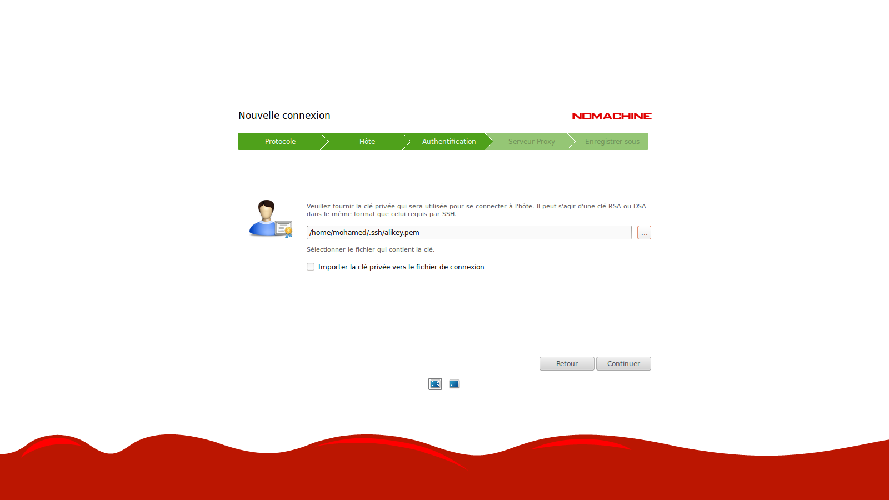

# 5 Minutes Stacks, épisode 39 : BioLinux 8 #

## Episode 39 : BioLinux 8

Bio-Linux 8 est une plate-forme puissante bioinformatique libres, poste de travail qui peut être installé sur quoi que ce soit à partir d'un ordinateur portable à un gros serveur, ou courir comme une machine virtuelle. Bio-Linux 8 ajoute plus de 250 paquets de bioinformatique à une base LTS Ubuntu Linux 14.04, fournissant environ 50 applications graphiques et plusieurs centaines d'outils de ligne de commande. L'environnement Galaxy pour l'analyse basée sur le navigateur des données et la construction de workflow est également incorporé dans Bio-Linux 8.

### Les versions

* BioLinux 8
* Vous trouverez la liste des packages dans cette [page](http://environmentalomics.org/bio-linux-software-list/)

### Enjoy

Pour accéder à la machine, vous avez deux choix :

1) Via ssh.
~~~bash
 $ ssh cloud@floating_ip -i your_key_pair.pem
~~~

2) Via le client [nomachine](https://www.nomachine.com/download) pour vous connecter à l'interface graphique GNOME.
L'utilsateur est **cloud** et le mot de passe par defaut **cloud**.

Pour changer le mot de passe de l'ulisateur cloud tapez la commande suivante.
~~~ bash
$ sudo passwd cloud
~~~

### Autres sources pouvant vous intéresser:

* [BioLinux homepage](http://environmentalomics.org/bio-linux/)

-----
Have fun. Hack in peace.
