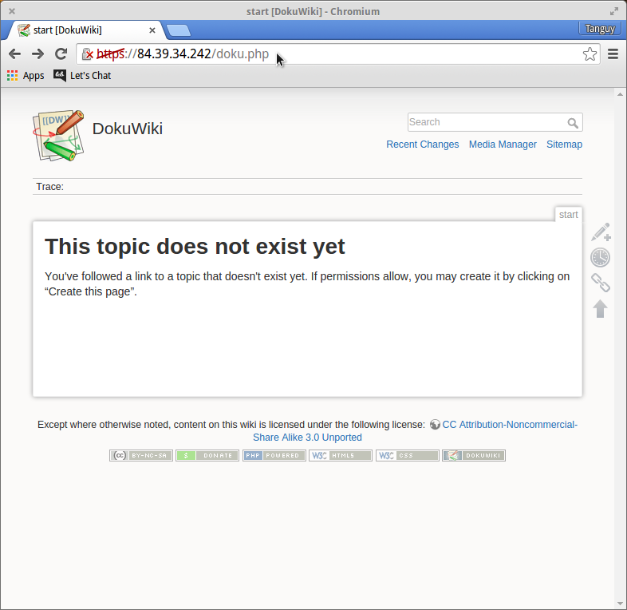
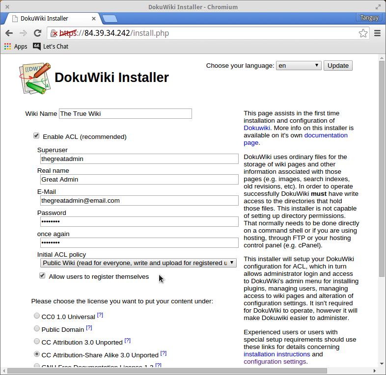

# 5 Minutes Stacks, Episode 12: Dokuwiki

## Episode 12: Dokuwiki

**Draft - Image not yet available...**

Dokuwiki is a completely open source and [highly versatile](https://www.dokuwiki.org/features) wiki software that functions entirely without a database. Easy to edit and boasting a strong library of [plugins](https://www.dokuwiki.org/plugins) and [themes](https://www.dokuwiki.org/template), the uses of Dokuwiki can extend much further than those of a traditional wiki. Want a preview? Dokuwiki's [entire website](https://www.dokuwiki.org) is actually a Dokuwiki.

## Preparation

### The Versions

* Dokuwiki :: 2015-08-10a "Detritus"

### The prerequisites to deploy this stack

These should be routine by now:

* Internet access
* A Linux shell
* A [Cloudwatt account](https://www.cloudwatt.com/authentification) with a [valid keypair](https://console.cloudwatt.com/project/access_and_security/?tab=access_security_tabs__keypairs_tab)
* The tools of the trade: [OpenStack CLI](http://docs.openstack.org/cli-reference/content/install_clients.html)
* A local clone of the [Cloudwatt applications](https://github.com/cloudwatt/applications) git repository (if you are creating your stack from a shell)
* The ID of an Neutron Subnet containing servers who need to connect to your LDAP instance.

### Size of the instance

By default, the stack deploys on an instance of type "Small" (s1.cw.small-1). A variety of other instance types exist to suit your various needs, allowing you to pay only for the services you need. Instances are charged by the minute and capped at their monthly price (you can find more details on the [Tarifs page](https://www.cloudwatt.com/fr/produits/tarifs.html) on the Cloudwatt website).

Dokuwiki stacks follow in the footsteps of our previous volume-using stacks, making good use of Cinder Volume Storage to ensure the protection of your data and allowing you to pay only for the space you use. Volume size is fully adjustable, and the Dokuwiki stack can support tens to tens of hundreds of gigabytes worth of project space.

Stack parameters, of course, are yours to tweak at your fancy.

### By the way...

As with the other volume-friendly bundles, the `.restore` heat template and `backup.sh` script enable you to manipulate Cinder Volume Storage. With these files, you may create Cinder Volume Backups: Save states of your Dokuwiki stack's volume for you to redeploy with the `.restore` heat template when needed.

Both normal and 'restored' stacks can be launched from the [console](#console), but our nifty `stack-start.sh` also allows you to create both kinds of stacks easily from a terminal.

Backups must be initialized with our handy `backup.sh` script and take a curt 5 minutes from start to full return of functionality. [(More about backing up and restoring your Dokuwiki...)](#backup)

## What will you find in the repository

Once you have cloned the github, you will find in the `bundle-trusty-dokuwiki/` repository:

* `bundle-trusty-dokuwiki.heat.yml`: HEAT orchestration template. It will be use to deploy the necessary infrastructure.
* `bundle-trusty-dokuwiki.restore.heat.yml`: HEAT orchestration template. It deploys the necessary infrastructure, and restores your data from a previous [backup](#backup).
* `backup.sh`: Backup creation script. Completes a full volume backup for safe-keeping.
* `stack-start.sh`: Stack launching script which simplifies the parameters.
* `stack-get-url.sh`: Returns the floating-IP in a URL which can also be found in the stack output.

### Initialize the environment

Log in to the [Cloudwatt Console](https://console.cloudwatt.com) and

Have your Cloudwatt username and password ready and click [download a 'Cloudwatt API' credentials script](https://console.cloudwatt.com/project/access_and_security/api_access/openrc/).
With it, you will be able to wield the amazing powers of the OpenStack APIs.

Source the downloaded file in your shell (enter your password when prompted) to begin using the OpenStack clients.

~~~ bash
$ source ~/Downloads/COMPUTE-[...]-openrc.sh
Please enter your OpenStack Password:

~~~

Only then can the Openstack command-line tools interact with your Cloudwatt user account.

<a name="parameters" />

### Adjust the parameters

In the `.heat.yml` files (the heat templates), you will find a section named `parameters` near the top. The only parameter without default is the `keypair_name`. Set the `default` value to a valid keypair with regards to your Cloudwatt user account, as **this will be the keypair you use to connect to your stack remotely**. A keypair can be generated from [the `Key Pairs` tab under `Access & Security` on the console](https://console.cloudwatt.com/project/access_and_security/?tab=access_security_tabs__keypairs_tab). Make sure to save the public key, otherwise you will not be able to connect to your machine by SSH.

It is also within the heat templates that you can adjust (and set the defaults for) the instance type, volume size, and volume type by playing with the `flavor_name`, `volume_size`, and `volume_type` parameters accordingly.

By default, the stack network and subnet are generated for the stack, in which the Dokuwiki server sits alone. This behavior can be changed within the heat templates as well, if need be.

~~~ yaml
heat_template_version: 2013-05-23

description: All-in-one DokuWiki stack

parameters:
  keypair_name:
    default: my-keypair-name                <-- Indicate your keypair here
    label: SSH Keypair
    description: Keypair to inject in instance
    type: string

  flavor_name:
    default: s1.cw.small-1                  <-- Indicate your instance type here
    label: Instance Type (Flavor)
    description: Flavor to use for the deployed instance
    type: string
    constraints:
      - allowed_values:
        [...]

  volume_size:
    default: 10                             <-- Indicate your volume size here
    label: Dokuwiki Volume Size
    description: Size of Volume for Dokuwiki Storage (Gigabytes)
    type: number
    constraints:
      - range: { min: 2, max: 1000 }
        description: Volume must be at least 2 gigabytes

  volume_type:
    default: standard                       <-- Indicate your volume type here
    label: Dokuwiki Volume Type
    description: Performance flavor of the linked Volume for Dokuwiki Storage
    type: string
    constraints:
      - allowed_values:
          - standard
          - performant

resources:
  network:
    type: OS::Neutron::Net

  subnet:
    type: OS::Neutron::Subnet
    properties:
      network_id: { get_resource: network }
      ip_version: 4
      cidr: 10.0.3.0/24
      allocation_pools:
        - { start: 10.0.3.100, end: 10.0.3.199 }
[...]

~~~

<a name="startup" />

## Start-up

Not a fan of shell? [Skip to stack creation from the console.](#console)

In a shell, run the script `stack-start.sh` (make sure you [set the default](#parameters) for the `flavor_name` parameter):

~~~ bash
$ ./stack-start.sh TRUEWIKI «my-keypair-name»
+--------------------------------------+------------+--------------------+----------------------+
| id                                   | stack_name | stack_status       | creation_time        |
+--------------------------------------+------------+--------------------+----------------------+
| xixixx-xixxi-ixixi-xiixxxi-ixxxixixi | TRUEWIKI   | CREATE_IN_PROGRESS | 2025-10-23T07:27:69Z |
+--------------------------------------+------------+--------------------+----------------------+

~~~

Within 5 minutes the stack will be fully operational; look at your `watch` to see the status in real-time.

~~~ bash
$ watch -n 1 heat stack-list
+--------------------------------------+------------+-----------------+----------------------+
| id                                   | stack_name | stack_status    | creation_time        |
+--------------------------------------+------------+-----------------+----------------------+
| xixixx-xixxi-ixixi-xiixxxi-ixxxixixi | TRUEWIKI   | CREATE_COMPLETE | 2025-10-23T07:27:69Z |
+--------------------------------------+------------+-----------------+----------------------+

~~~

Nice `watch`.

### Enjoy

Once your `stack_status` is `CREATE_COMPLETE`, you can run the `stack-get-url.sh` script.

~~~ bash
$ ./stack-get-url.sh TRUEWIKI

STACK   TRUEWIKI
URL     https://70.60.637.17
INSTALL https://70.60.637.17/install.php

~~~

As shown above, it will parse the assigned floating-IP of your stack into a URL link. You can then click or paste this into your browser of choice, confirm the use of the self-signed certificate, and [get ready to wiki~](#using_stack)

### In the background

The `start-stack.sh` script runs the necessary OpenStack API requests to execute the heat template which:
* Starts a Ubuntu Trusty Tahr based instance
* Attaches an exposed floating-IP for Dokuwiki
* Starts, attaches, and formats a fresh volume for all of Dokuwiki's data, or restores one from a provided backup_id
* Reconfigures Dokuwiki to store its data in the volume

<a name="console" />

## Command line sounds as friendly as military management

Lucky for you then, all of the setup for Dokuwiki can be accomplished using only the web-interface. As usual however, backing up your beloved Dokuwiki involves our super handy `backup.sh` script.

To create your Dokuwiki stack from the [Cloudwatt Console](https://console.cloudwatt.com):

1.	Go the Cloudwatt Github in the [applications/bundle-trusty-dokuwiki](https://github.com/cloudwatt/applications/tree/master/bundle-trusty-dokuwiki) repository
2.	Click on the file named `bundle-trusty-dokuwiki.heat.yml` (or `bundle-trusty-dokuwiki.restore.heat.yml` to [restore from backup](#backup))
3.	Click on RAW, a web page will appear containing purely the [New](https://raw.githubusercontent.com/cloudwatt/applications/master/bundle-trusty-dokuwiki/bundle-trusty-dokuwiki.heat.yml) or [Restore](https://raw.githubusercontent.com/cloudwatt/applications/master/bundle-trusty-dokuwiki/bundle-trusty-dokuwiki.restore.heat.yml) template
4.	Save the file to your PC. You can use the default name proposed by your browser (just remove the `.txt` if needed)
5.  Go to the [Stacks](https://console.cloudwatt.com/project/stacks/) section of the console
6.	Click on `LAUNCH STACK`, then `Browse` under `Template file` and select the file you just saved to your PC, and finally click on `NEXT`
7.	Name your stack in the `Stack Name` field
10.	Choose your instance flavor using the `Instance Type` dropdown
8.	Enter the name of your keypair in the `SSH Keypair` field
9.	Confirm the volume size (in gigabytes) and type in the `Dokuwiki Volume Size` and `Dokuwiki Volume Type` fields and click on `LAUNCH`

The stack will be automatically generated (you can see its progress by clicking on its name). When all modules become green, the creation will be complete. You can then go to the "Instances" menu to find the floating-IP, or simply refresh the current page and check the Overview tab for a handy link.

If you've reached this point, your stack is up! Go set up and enjoy Dokuwiki!

<a name="using_stack" />

## Using Dokuwiki

Setting up Dokuwiki is simple: follow this image-aided guide and you will be wiki-ing in no time.

For the sake of simplicity, we'll omit the IP address when naming links: if your floating-IP URL is `https://70.60.637.17`, then `/some/path` would be `https://70.60.637.17/some/path`.

Since Dokuwiki uses self-signed SSL certificates, it rubs a few browsers the wrong way, **Firefox worst of all**. (You've been warned.) Don't worry about what your browser says: validate the SSL exceptions and whatnot, and from then on the browser shouldn't bother you any further.

Once you reach your Dokuwiki homepage you will likely reach a page like the one below.

Yay Dokuwiki! There is a bit setup left though. Go to `/install.php` to "install" Dokuwiki.

A few things of note here:

* Name the wiki whatever you wish.
* You definitely want ACL enabled: it's the login tool for Dokuwiki. (Unless you dig anarchy on your wiki, in which case uncheck that sucker.)
* The `Superuser` will be the only one with access to the Dokuwiki admin panel by default.
* The `Real Name` and `E-Mail` and `Password` fields are yours to fill as you please.
* Set the ACL level to suit your needs.
* You can create users and roles from the admin panel by hand; with this in mind, choose whether to allow users to register themselves.

Below the form it will ask you to pick a license for your wiki: study up if you wish, then make your pick and save.

Dokuwiki is now ready: follow the `your new DokuWiki` link on the page you were redirected to (or go to `/doku.php?id=wiki:welcome`) for a smart little Dokuwiki to help you start using your wiki!

[Configuring your Dokuwiki](https://www.dokuwiki.org/config)

<a name="backup" />

## Back up and Restoration

Backing up your Dokuwiki sounds like great idea, right? We've worked hard to make saving your work quick and easy.

~~~ bash
$ ./backup.sh TRUEWIKI

~~~

And five minutes later you're back in business and your conscience is at ease!
Restoration is as simple as building another stack, although this time with the `.restore.heat.yml`, and specifying the ID of the backup you want. The new volume size should not be smaller than the original in order to avoid data loss/corruption. A list of backups can be found in the «Volume Backups» tab under «Volumes» in the console, or from the command line with the Cinder API:

~~~ bash
$ cinder backup-list

+------+-----------+-----------+-------------------------------------+------+--------------+---------------+
|  ID  | Volume ID |   Status  |                 Name                | Size | Object Count |   Container   |
+------+-----------+-----------+-------------------------------------+------+--------------+---------------+
| XXXX | XXXXXXXXX | available | TRUEWIKI-backup-2025/10/23-07:27:69 |  10  |     206      | volumebackups |
+------+-----------+-----------+-------------------------------------+------+--------------+---------------+

~~~

## So watt?

The goal of this tutorial is to accelerate your start. At this point **you** are the master of the stack.

You now have an SSH access point on your virtual machine through the floating-IP and your private keypair (default user name *cloud*).

The interesting directories are:

- `/dev/vdb`: Volume mount point
- `/mnt/vdb/`: `/dev/vdb` mounts here: contains all of Dokuwiki's data
- `/mnt/vdb/stack_public_entry_point`: Contains last known floating-IP address, used to replace the floating-IP address in all locations when it changes
- `/etc/dokuwiki/ssl/`: The server's `.key` and self-signed `.crt` for HTTPS
- `/etc/dokuwiki/dokuwiki-volume.sh`: Script run upon reboot to remount the volume and verify Dokuwiki is ready to function again
- `/var/www/dokuwiki`: Dokuwiki volume mount point

Other resources you could be interested in:

* [Dokuwiki Homepage](https://www.dokuwiki.org)
* [Dokuwiki Features](https://www.dokuwiki.org/features)
* [Dokuwiki Configuration](https://www.dokuwiki.org/config)
* [Dokuwiki Plugins](https://www.dokuwiki.org/plugins)
* [Dokuwiki Themes/Skins](https://www.dokuwiki.org/template)

-----
Have fun. Hack in peace.
