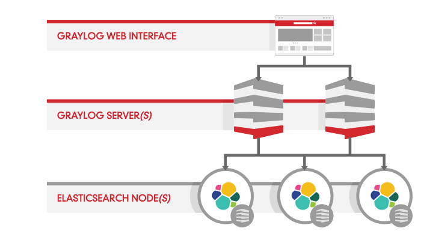
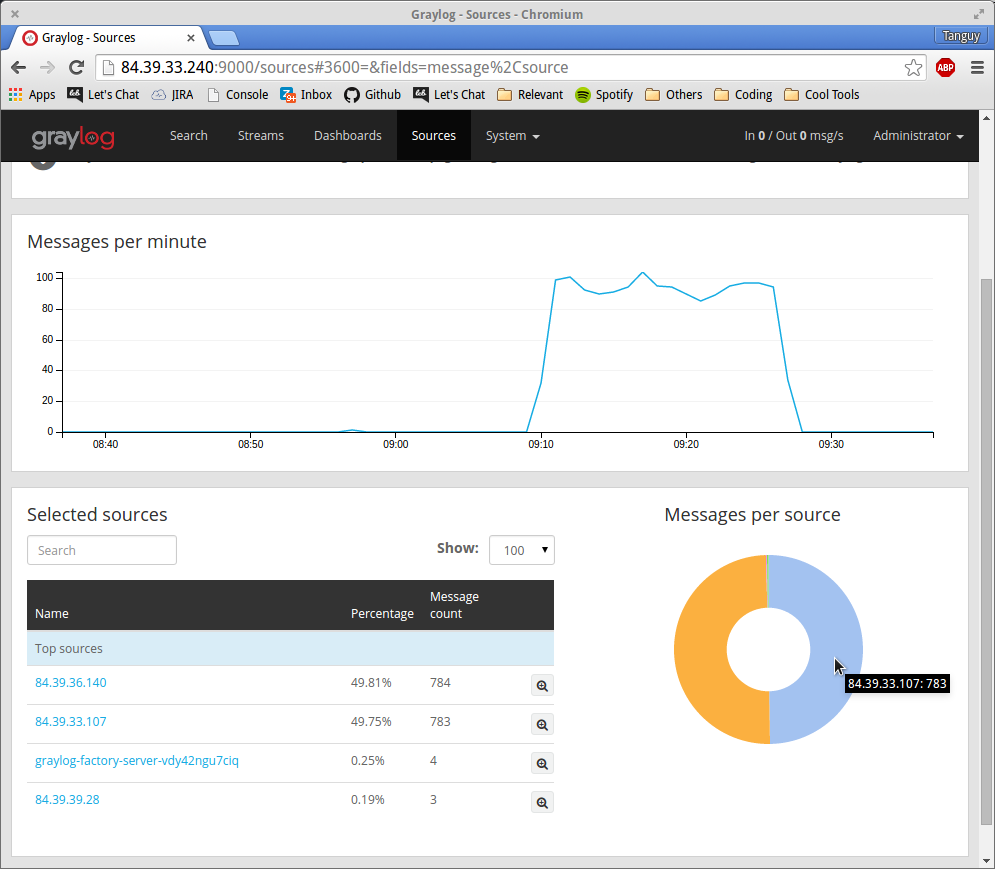

# 5 Minutes Stacks, Episode 14: Graylog

## Episode 14: Graylog

**Projet - Image actuellement non disponible...**

Graylog is an open source log management platform capable of manipulating and presenting data from virtually any source. At it's core, Graylog consists of a 3-tier architecture:

* The Graylog Web Interface is a powerful tool that allows anyone to manipulate the entirety of what Graylog has to offer through an intuitive and appealing web application.
* At the heart of Graylog is it's own strong software. Graylog Server interacts with all other components using REST APIs so that each component of the system can be scaled without comprimising the integrity of the system as a whole.
* Real-time search results when you want them and how you want them: Graylog is only able to provide this thanks to the tried and tested power of Elasticsearch. The Elasticsearch nodes behind the scenes give Graylog the speed that makes it a real pleasure to use.

Boasting this impressive architecture as well as a vast library of plugins, Graylog stands as a strong and versatile log management solution.

By following this guide you will deploy a compressed but fully functional version of Graylog: Graylog Web and Server as well as Elasticsearch all deployed on one instance. This is a great way to discover the potential of Graylog and explore it's versatile web UI without expending many resources.

## Préparations

### La version

* Graylog (graylog-server/graylog-web) 1.2.2-1
* Elasticsearch (elasticsearch) 1.7.3
* MongoDB (mongodb-org) 3.0.7

### Les pré-requis pour déployer cette stack

Ceci devrait être une routine à présent:

* Un accès internet
* Un shell linux
* Un [compte Cloudwatt](https://www.cloudwatt.com/authentification) avec une [ paire de clés existante](https://console.cloudwatt.com/project/access_and_security/?tab=access_security_tabs__keypairs_tab)
* Les outils [OpenStack CLI](http://docs.openstack.org/cli-reference/content/install_clients.html)
* Un clone local du dépôt git [Cloudwatt applications](https://github.com/cloudwatt/applications)

### Taille de l'instance

Par défaut, le script propose un déploiement sur une instance de type "Small" (s1.cw.small-1). Il existe une variété d'autres types d'instances pour la satisfaction de vos multiples besoins. Les instances sont facturés à la minute, vous permettant de payer uniquement pour les services que vous avez consommés et plafonnés à leur prix mensuel (vous trouverez plus de détails sur la [Page tarifs ](https://www.cloudwatt.com/fr/produits/tarifs.html) du site de Cloudwatt).

Vous pouvez ajuster les parametres de la stack à votre goût.

### Au fait...

Si vous n’aimez pas les lignes de commande, vous pouvez passer directement à la version "Je lance avec la console" en cliquant sur [ce lien](#console)...

## Tour du propriétaire

Une fois le dépôt cloné, vous trouverez le répertoire `bundle-trusty-graylog/`

* `bundle-trusty-graylog.heat.yml`: Template d'orchestration HEAT, qui servira à déployer l'infrastructure nécessaire.
* `stack-start.sh`: Stack launching script, which simplifies the parameters and secures the admin password creation.
* `stack-get-url.sh`: Script de récupération de l'IP d'entrée de votre stack, qui peut aussi se trouver dans les parametres de sortie de la stack.

## Démarrage

### Initialiser l'environnement

Munissez-vous de vos identifiants Cloudwatt, et cliquez [ICI](https://console.cloudwatt.com/project/access_and_security/api_access/openrc/).
Si vous n'êtes pas connecté, vous passerez par l'écran d'authentification, puis le téléchargement d'un script démarrera. C'est grâce à celui-ci que vous pourrez initialiser les accès shell aux API Cloudwatt.

Sourcez le fichier téléchargé dans votre shell et entrez votre mot de passe lorsque vous êtes invité à utiliser les clients OpenStack.

~~~ bash
$ source COMPUTE-[...]-openrc.sh
Please enter your OpenStack Password:

$ [whatever mind-blowing stuff you have planned...]
~~~

Une fois ceci fait, les outils de ligne de commande d'OpenStack peuvent interagir avec votre compte Cloudwatt.

### Adjust the parameters

In the `.heat.yml` files (heat templates), you will find a section named `parameters` near the top. The mandatory parameters are the `keypair_name` and the `password` for the Graylog *admin* user.

You can set the `keypair_name`'s `default` value to save yourself time, as shown below.
Remember that key pairs are created [from the console](https://console.cloudwatt.com/project/access_and_security/?tab=access_security_tabs__keypairs_tab), and only keys created this way can be used.

The `password` field provides the password for Graylog's default *admin* user. You will need it upon initial login, but you can always create other users later. You can also adjust (and set the default for) the instance type by playing with the `flavor` parameter accordingly.

By default, the stack network and subnet are generated for the stack, in which the Graylog server sits alone. This behavior can be changed within the `.heat.yml` as well, if needed.

~~~ yaml
heat_template_version: 2013-05-23

description: All-in-one Graylog stack

parameters:
  keypair_name:
    label: SSH Keypair
    description: Keypair to inject in instance
    type: string
    default: my-keypair-name                <-- Indicate your key pair name here

  password:
    label: Password
    description: Graylog root user password
    type: string
    hidden: true
    constraints:
      - length: { min: 6, max: 96 }
        description: Password must be between 6 and 96 characters

  flavor_name:
    label: Instance Type (Flavor)
    description: Flavor to use for the deployed instance
    type: string
    default: s1.cw.small-1
    constraints:
      - allowed_values:
        [...]

resources:
  network:
    type: OS::Neutron::Net

  subnet:
    type: OS::Neutron::Subnet
    properties:
      network_id: { get_resource: network }
      ip_version: 4
      cidr: 10.0.1.0/24
      allocation_pools:
        - { start: 10.0.1.100, end: 10.0.1.199 }
[...]
~~~

<a name="startup" />

### Stack up with a terminal

In a shell, run the script `stack-start.sh`:

~~~ bash
$ ./stack-start.sh TICKERTAPE «my-keypair-name»
Enter your new admin password:
Enter your new password once more:
Creating stack...
+--------------------------------------+------------+--------------------+----------------------+
| id                                   | stack_name | stack_status       | creation_time        |
+--------------------------------------+------------+--------------------+----------------------+
| xixixx-xixxi-ixixi-xiixxxi-ixxxixixi | TICKERTAPE | CREATE_IN_PROGRESS | 2025-10-23T07:27:69Z |
+--------------------------------------+------------+--------------------+----------------------+
~~~

Within 5 minutes the stack will be fully operational. (Use watch to see the status in real-time)

~~~ bash
$ watch -n 1 heat stack-list
+--------------------------------------+------------+-----------------+----------------------+
| id                                   | stack_name | stack_status    | creation_time        |
+--------------------------------------+------------+-----------------+----------------------+
| xixixx-xixxi-ixixi-xiixxxi-ixxxixixi | TICKERTAPE | CREATE_COMPLETE | 2025-10-23T07:27:69Z |
+--------------------------------------+------------+-----------------+----------------------+
~~~

### Stack URL with a terminal

Once all of this done, you can run the `stack-get-url.sh` script.

~~~ bash
$ ./stack-get-url.sh TICKERTAPE
TICKERTAPE  http://70.60.637.17:9000/
~~~

As shown above, it will parse the assigned floating-IP of your stack into a URL link, with the right port included. You can then click or paste this into your browser of choice and bask in the glory of a fresh Graylog instance.

<a name="console" />

### Please console me

There there, it's okay... Graylog stacks can be spawned from our console as well!

To create our Graylog stack from the console:

1.	Go the Cloudwatt Github in the [applications/bundle-trusty-graylog](https://github.com/cloudwatt/applications/tree/master/bundle-trusty-graylog) repository
2.	Click on the file named `bundle-trusty-graylog.heat.yml`
3.	Click on RAW, a web page will appear containing purely the template
4.	Save the page to your PC. You can use the default name proposed by your browser (just remove the .txt if needed)
5.  Go to the [Stacks](https://console.cloudwatt.com/project/stacks/) section of the console
6.	Click on **Launch stack**, then **Template file** and select the file you just saved to your PC, and finally click on **NEXT**
7.	Name your stack in the **Stack name** field
8.	Enter the name of your keypair in the **SSH Keypair** field
9.	Enter the password for the default *admin* user
10.	Choose your instance size using the **Instance Type** dropdown and click on **LAUNCH**

The stack will be automatically generated (you can see its progress by clicking on its name). When all modules become green, the creation will be complete. You can then go to the "Instances" menu to find the floating-IP, or simply refresh the current page and check the Overview tab for a handy link.

Remember that the Graylog UI is on port 9000, not the default port 80!

## So watt?

The goal of this tutorial is to accelerate your start. At this point **you** are the master of the stack. The default user is *admin* with the password you set during stack creation. An easy way to [get started](http://docs.graylog.org/en/1.2/pages/getting_started.html#get-messages-in) is to have your Graylog server log itself!

Graylog takes inputs from a plethora of ports and protocols, I recommend you take the time to document yourselves on the possibilities. Just remember that all input and output ports must be explicitly set in the stack's [security group](https://console.cloudwatt.com/project/access_and_security/?tab=access_security_tabs__security_groups_tab). To add an input, click on **MANAGE RULES** for your stack's security group and then, once on the page *MANAGE SECURITY GROUP RULES*, click **+ ADD RULE**. If logs don't make it to your graylog instance, check the [security group](https://console.cloudwatt.com/project/access_and_security/?tab=access_security_tabs__security_groups_tab) first!

Once you are receiving logs from a variety of sources, dashboards will certainly become your favorite tool. Search results can be converted into widgets that update in real-time, and dashboards let you organize those widgets into information-rich panels that can give essential visibility on the state of your environment. Take the time to create a dashboard which displays the information you care about, and monitoring your VMs is sure to become a more pleasant experience.

You also now have an SSH access point on your virtual machine through the floating-IP and your private key pair (default user name `cloud`). Be warned, the default browser connection to Graylog is not encrypted (HTTP): if you are using your Graylog instance to store sensitive data, you may want to connect with an SSH tunnel instead.

~~~ bash
user@home$ cd applications/bundle-trusty-graylog/
user@home$ ./stack-get-url.sh TICKERTAPE
TICKERTAPE  http://70.60.637.17:9000/
user@home$ ssh 70.60.637.17 -l cloud -i /path/to/your/.ssh/keypair.pem -L 5000:localhost:9000
[...]
cloud@graylog-server$ █
~~~

By doing the above, I could then access my Graylog server from http://localhost:5000/ on my browser. ^^

## The State of Affairs

This bundle deploys the minimum Graylog setup for use in smaller, non-critical, or test setups. None of the components are redundant but it is resource-light and quick to launch.

Bigger production environments are much heftier but carry a number of advantages, not least among them being fluid horizontal scaling. This allows Graylog to expand and shrink to meet the current workload. If you are interested in such an environment, check out the link *Graylog architectural considerations* below.

#### The interesting directories are:

- `/etc/graylog/server/server.conf`: Graylog server configuration
- `/etc/graylog/web/web.conf`: Graylog web UI configuration
- `/etc/elasticsearch/elasticsearch.yml`: Elasticsearch configuration

#### Other resources you could be interested in:

* [Graylog Homepage](https://www.graylog.org/)
* [Graylog - Getting Started](http://docs.graylog.org/en/1.2/pages/getting_started.html#get-messages-in)
* [Graylog architectural considerations](http://docs.graylog.org/en/1.3/pages/architecture.html)
* [Elasticsearch Homepage](https://www.elastic.co/products/elasticsearch)
* [Installing MongoDB on Ubuntu](https://docs.mongodb.org/manual/tutorial/install-mongodb-on-ubuntu/)

-----
Have fun. Hack in peace.
