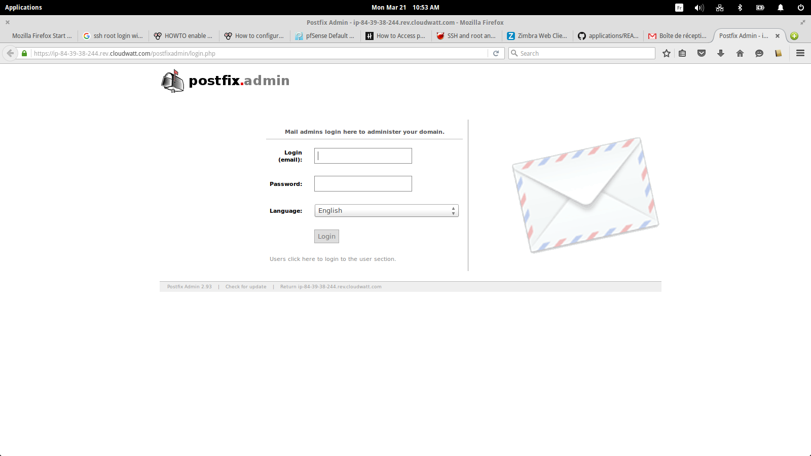
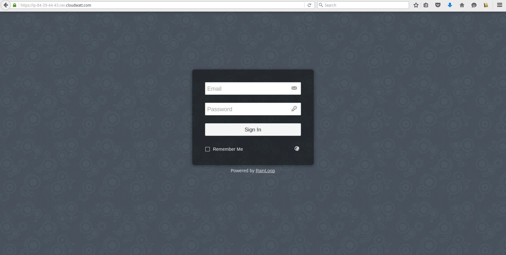
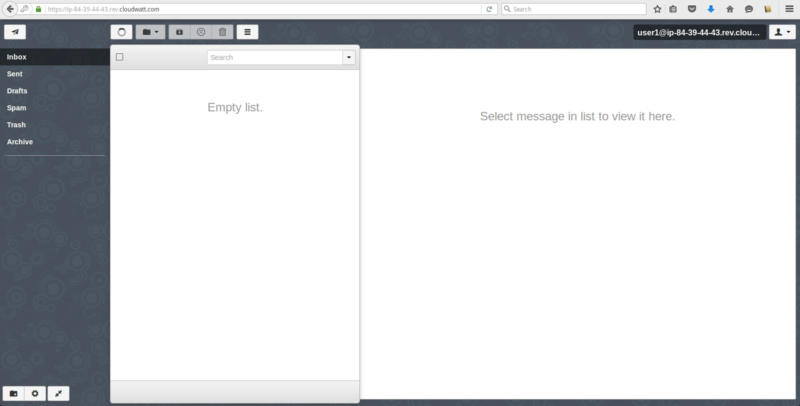
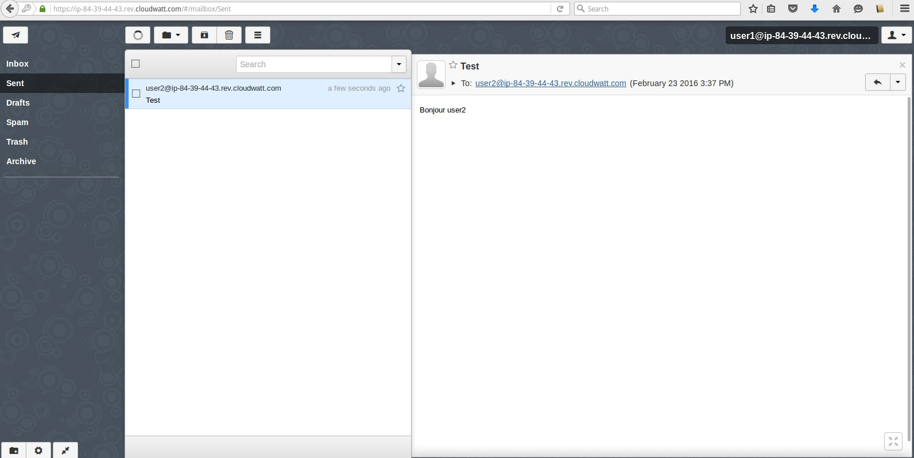
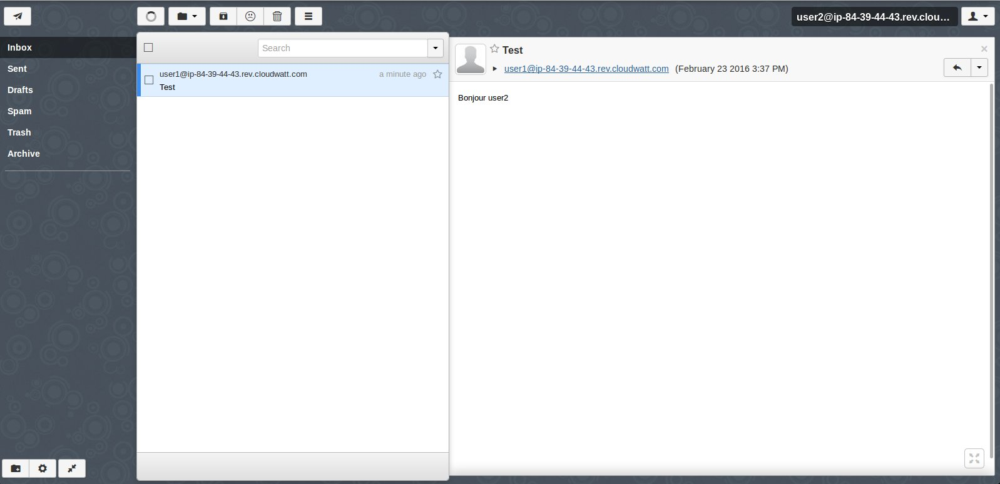
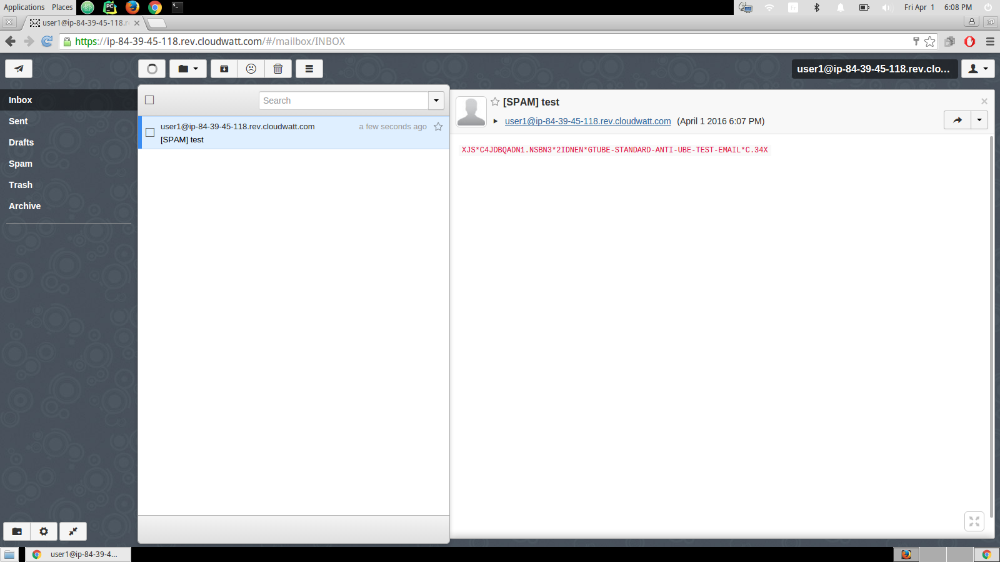
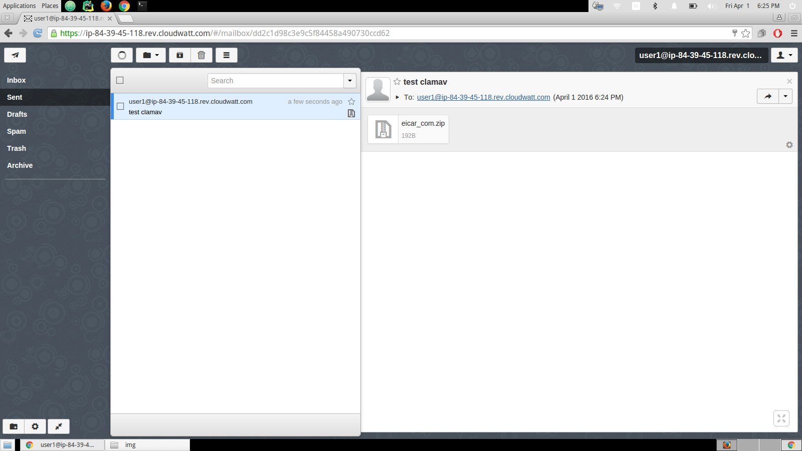
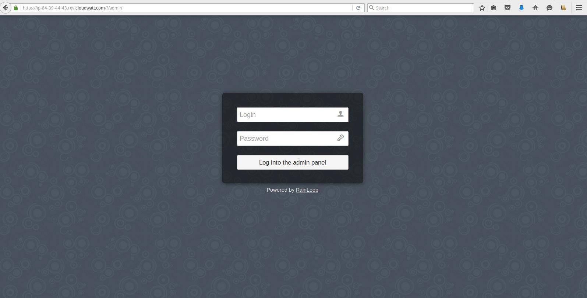
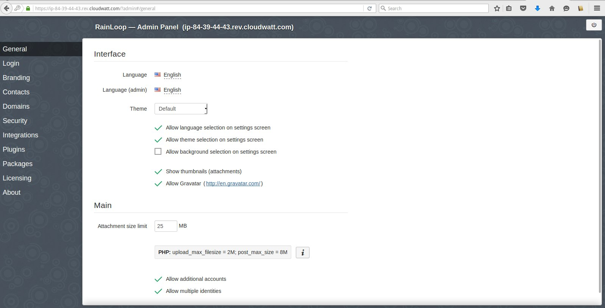

# 5 Minutes Stacks, 26 episode : Webmail Antispam #

## Episode 26 : Webmail Antispam

An email server is a mail server software (email). It aims to transfer emails from one server to another. An user is never in direct contact with this server uses either a mail client or a webmail client, which is responsible to contact the server to send or receive messages.
In this episode we used Rainloop as open source webmail that is developed in PHP and designed to be comprehensive and easy to use. It manages very well IMAP / SMTP protocols and has a modern interface (HTML5 / CSS3) very Ergonomic, it is rather pleasant. In terms of features, there are all those of a conventional mail client, plus a system of plugins.

We will show you how to build your webmail stack and how to secure it, thanks to **ClamAV** and **SpamAssassin**.

## Preparations

### The version
 - Ubuntu Trusty 14.04
 - Postfix 2.11.0
 - Postfixadmin-2.93
 - Dovecot 2.2.9
 - SpamAssassin 3.4.0
 - Clamsmtpd 1.10
 - Apache 2.4.7
 - Mysql 5.5.47
 - Rainloop

### The prerequisites to deploy this stack

 * an internet acces
 * a Linux shell
 * a [Cloudwatt account](https://www.cloudwatt.com/cockpit/#/create-contact), with an [existing keypair](https://console.cloudwatt.com/project/access_and_security/?tab=access_security_tabs__keypairs_tab)
 * the tools [OpenStack CLI](http://docs.openstack.org/cli-reference/content/install_clients.html)
 * a local clone of the git repository [Cloudwatt applications](https://github.com/cloudwatt/applications)

### Size of the instance

 Per default, the script is proposing a deployement on an instance type "Standard" (n2.cw.standard-1).  Instances are charged by the minute and capped at their monthly price (you can find more details on the [Tarifs page](https://www.cloudwatt.com/fr/produits/tarifs.html) on the Cloudwatt website). Obviously, you can adjust the stack parameters, particularly its defaut size.

### By the way...

 If you do not like command lines, you can go directly to the "run it through the console" section by clicking [here](#console)

## What will you find in the repository

 Once you have cloned the github, you will find in the `bundle-trusty-webmail/` repository:

 * `bundle-trusty-webmail.heat.yml`: HEAT orchestration template. It will be use to deploy the necessary infrastructure.
 * `stack-start.sh`: Stack launching script. This is a small script that will save you some copy-paste.
 * `stack-get-url.sh`: Flotting IP recovery script.

## Start-up

### Initialize the environment

 Have your Cloudwatt credentials in hand and click [HERE](https://console.cloudwatt.com/project/access_and_security/api_access/openrc/).
 If you are not logged in yet, you will go thru the authentication screen then the script download will start. Thanks to it, you will be able to initiate the shell accesses towards the Cloudwatt APIs.

 Source the downloaded file in your shell. Your password will be requested.

 ~~~ bash
 $ source COMPUTE-[...]-openrc.sh
 Please enter your OpenStack Password:

 ~~~

 Once this done, the Openstack command line tools can interact with your Cloudwatt user account.

### Adjust the parameters

 With the `bundle-trusty-webmail.heat.yml` file, you will find at the top a section named `parameters`. The sole mandatory parameter to adjust is the one called `keypair_name`. Its `default` value must contain a valid keypair with regards to your Cloudwatt user account. This is within this same file that you can adjust the instance size by playing with the `flavor` parameter.

 ~~~ yaml
 heat_template_version: 2013-05-23

 description: Basic all-in-one WEBMAIL stack

 parameters:
  keypair_name:
     default: keypair_name        <-- Indicate here your keypair
     description: Keypair to inject in instances
     type: string
  mysql_password:
     description: Mysql password
     label: Mysql password
     type: string
     default: changeme            <-- Indicate here your database password
  postfix_admin_pass:
     description: postfixadmin password
     label: postfixadmin password
     type: string
     default: changeme            <-- Indicate here your postfix admin password
  mail_domain:
     description: mail domain
     label: mail domain
     type: string
     default: exemple.com         <-- Indicate here your domain name
flavor_name:
     default: n2.cw.standard-1              <-- indicate here the flavor size
     description: Flavor to use for the deployed instance
     type: string
     constraints:
       - allowed_values:
         - t1.cw.tiny
         - s1.cw.small-1
         - n2.cw.standard-1
         - n2.cw.standard-2
         - n2.cw.standard-4
         - n2.cw.standard-8
         - n2.cw.standard-16
         - n2.cw.highmem-2
         - n2.cw.highmem-4
         - n2.cw.highmem-8
         - n2.cw.highmem-12
 [...]
 ~~~
 ### Start stack

 In a shell, run the script `stack-start.sh`:

 ~~~ bash
 ./stack-start.sh your_stack_name your_keypair_name mysql_password postfix_admin_pass mail_domain
 ~~~
 Exemple :

 ~~~bash
 $ ./stack-start.sh EXP_STACK

 +--------------------------------------+------------+--------------------+----------------------+
 | id                                   | stack_name | stack_status       | creation_time        |
 +--------------------------------------+------------+--------------------+----------------------+
 | xixixx-xixxi-ixixi-xiixxxi-ixxxixixi | your_stack_name | CREATE_IN_PROGRESS | 2025-10-23T07:27:69Z |
 +--------------------------------------+------------+--------------------+----------------------+
 ~~~

 Wait **5 minutes** the stack will be fully operational. (Use watch to see the status in real-time)

 ~~~ bash
 $ watch -n 1 heat stack-list
 +--------------------------------------+------------+-----------------+----------------------+
 | id                                   | stack_name | stack_status    | creation_time        |
 +--------------------------------------+------------+-----------------+----------------------+
 | xixixx-xixxi-ixixi-xiixxxi-ixxxixixi | your_stack_name | CREATE_COMPLETE | 2025-10-23T07:27:69Z |
 +--------------------------------------+------------+-----------------+----------------------+
 ~~~
 ~~~bash
$ watch heat resource-list your_stack_name
+------------------+-----------------------------------------------------+---------------------------------+-----------------+----------------------+
| resource_name    | physical_resource_id                                | resource_type                   | resource_status | updated_time         |
+------------------+-----------------------------------------------------+---------------------------------+-----------------+----------------------+
| floating_ip      | 44dd841f-8570-4f02-a8cc-f21a125cc8aa                | OS::Neutron::FloatingIP         | CREATE_COMPLETE | 2015-11-25T11:03:51Z |
| security_group   | efead2a2-c91b-470e-a234-58746da6ac22                | OS::Neutron::SecurityGroup      | CREATE_COMPLETE | 2015-11-25T11:03:52Z |
| network          | 7e142d1b-f660-498d-961a-b03d0aee5cff                | OS::Neutron::Net                | CREATE_COMPLETE | 2015-11-25T11:03:56Z |
| subnet           | 442b31bf-0d3e-406b-8d5f-7b1b6181a381                | OS::Neutron::Subnet             | CREATE_COMPLETE | 2015-11-25T11:03:57Z |
| server           | f5b22d22-1cfe-41bb-9e30-4d089285e5e5                | OS::Nova::Server                | CREATE_COMPLETE | 2015-11-25T11:04:00Z |
| floating_ip_link | 44dd841f-8570-4f02-a8cc-f21a125cc8aa-`floating IP`  | OS::Nova::FloatingIPAssociation | CREATE_COMPLETE | 2015-11-25T11:04:30Z |
  +------------------+-----------------------------------------------------+-------------------------------+-----------------+----------------------
~~~

The `start-stack.sh` script takes care of running the API necessary requests to execute the normal heat template which:

* Starts an Ubuntu Trusty Tahr based instance
* Expose it on the Internet via a floating IP.

## All of this is fine,
### but you do not have a way to create the stack from the console?

We do indeed! Using the console, you can deploy a mail server:

1.	Go the Cloudwatt Github in the [applications/bundle-trusty-mail]https://github.com/cloudwatt/applications/tree/master/bundle-trusty-webmail) repository
2.	Click on the file named `bundle-trusty-webmail.heat.yml` (or `bundle-trusty-webmail.restore.heat.yml` to [restore from backup](#backup))
3.	Click on RAW, a web page will appear containing purely the template
4.	Save the file to your PC. You can use the default name proposed by your browser (just remove the .txt)
5.  Go to the « [Stacks](https://console.cloudwatt.com/project/stacks/) » section of the console
6.	Click on « Launch stack », then « Template file » and select the file you just saved to your PC, and finally click on « NEXT »
7.	Name your stack in the « Stack name » field
8.	Enter the name of your keypair in the « SSH Keypair » field
9.  Write a passphrase that will be used for encrypting backups
10.	Choose your instance size using the « Instance Type » dropdown and click on « LAUNCH »

The stack will be automatically generated (you can see its progress by clicking on its name). When all modules become green, the creation will be complete. You can then go to the "Instances" menu to find the floating IP, or simply refresh the current page and check the Overview tab for a handy link.

If you've reached this point, you're already done! Go enjoy Mail!

### A one-click chat sounds really nice...

... Good! Go to the [Apps page](https://www.cloudwatt.com/fr/applications/index.html) on the Cloudwatt website, choose the apps, press **DEPLOYER** and follow the simple steps... 2 minutes later, a green button appears... **ACCEDER**: you have your mail server!

## Enjoy
Once this is done you can connect via a web browser on the postfixamdin interface from this url `https://ip-floatingip.rev.cloudwatt.com/postfixadmin` ou `https://floatingIP/postfixadmin` in order to start adding your domains and emails,for logging you use  **admin@ip-floatingip.rev.cloudwatt.com** as login and **password_admin** as password.

For knowing how to manager the postfixadmin you can see this link [postfixadmin](http://postfixadmin.sourceforge.net/screenshots/).

For email inboxes you see this URL `https://ip-floatingip.rev.cloudwatt.com/` or `https://floatingIP/` via a web browser.

You have to arrive on these pages:

For logging you have to use Linux users and you begin to send and receive emails.

user1 send an email to user2.

user2 receive user1 email.

For testing Spamassassin works well, Send an email contains this text `XJS*C4JDBQADN1.NSBN3*2IDNEN*GTUBE-STANDARD-ANTI-UBE-TEST-EMAIL*C.34X`
You'll have an email that 's marked [SPAM].

For testing ClamAV works well, Send this virus `http://eicar.org/download/eicar_com.zip`
You won't receive this email beacuase it is blocked by ClamAv
 ,you can see the logs in `/var/log/mail.log` file.

This is the logs in  `/var/log/mail.log` file.

In this exemple we used the default domain name provided by cloudwatt (`https://ip-floatingip.rev.cloudwatt.com` juste replace the "." by "-" in your floatingIP ( example: ip-10-11-12-13.rev.cloudwatt.com )),
if you want to change  the domain of your mail server ,in order to be able to set your,here is the method:

In `etc/postfix/main.cf` change your domain name in this parameters:

      - mydomain:
      - myhostname:
      - mydestination:

In `/etc/apache2/sites-available/vhost.conf` change your domain name in this parameters:

      - ServerName
      - ServerAdmin: this parameter defines the address Administrator Email

In `/var/www/cw/data/_data_/_default_/domains/domain.ini`:

      - smtp_host
      - imap_host

Don't forget to edit the both files `/etc/hosts` et `/etc/hostname`.

**then restart the services postfix,dovecot and apache2:**

~~~ bash
# service postfix restart
# service dovecot restart
# service apache2 restart
~~~
Make a refresh on the url `http://floatingIP/`

**If you want to change rainloop configuration**

Access to  `https://floatingIP/?admin` or `https://ip-floatingip.rev.cloudwatt.com/?admin` with web browser on Client,then login with a user and password for initial login, user is "admin" and password is "12345".

 

**For more security** Don't froget to change admin password through this interface

An SSL certificate is automatically generated via Let's encrypt and it is renewed via a CRON job every 90 days.
The updates ClamAv signatures is via cron everyday.

## So watt?
The interesting directories and files are:

`/etc/apache2`: Apache configuration files

`/etc/postfix`: Postfix configuration files

`/etc/dovecot`: Dovecot configuration files

`/etc/clamsmtpd.conf`: ClamAv configuration file

`/etc/spamassassin/`: SpamAssassin configuration files

`/var/www/cw/data/_data_/_default_/`: Rainloop configuration files

### Other resources you could be interested in:
* [ Postfix Home page](http://www.postfix.org/documentation.html)
* [ Dovecot Documentation](http://www.dovecot.org/)
* [ Rainloop Documentation](http://www.rainloop.net)
* [ ClamAv Documentation](http://www.clamav.net/)

----
Have fun. Hack in peace.
